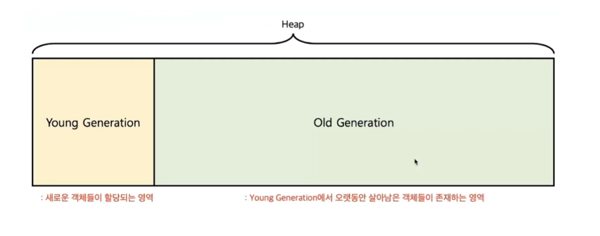
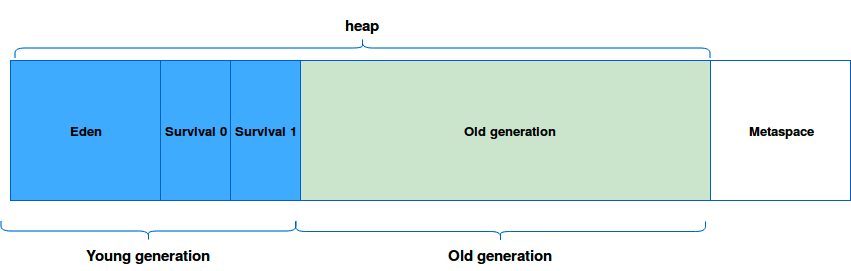
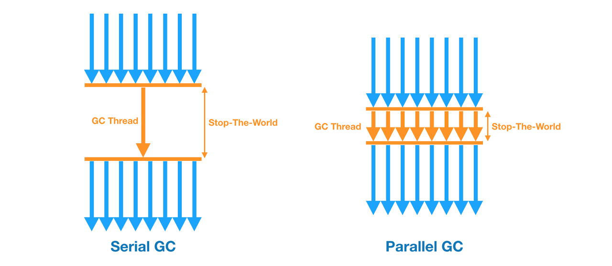
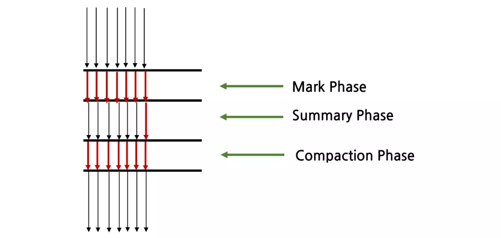
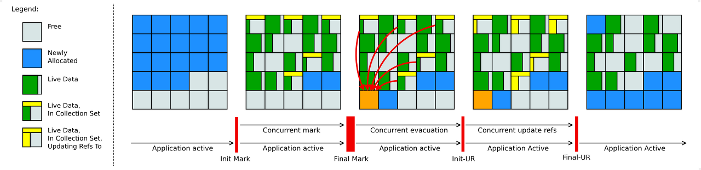
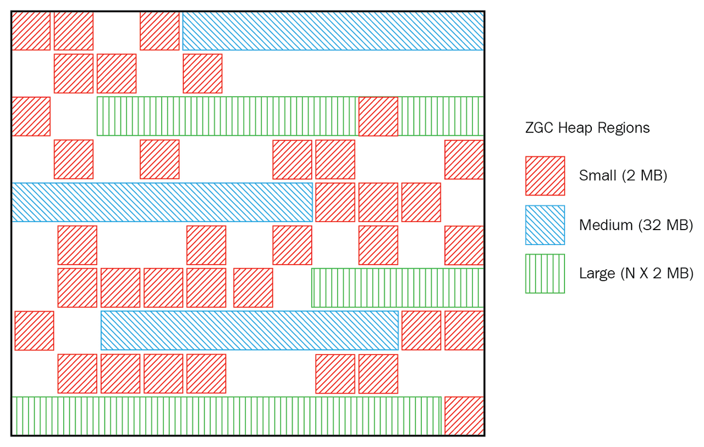

# GC(Garbage Collection)란 무엇인가요?

- _**GC(Garbage Collection)**_
- 프로그램을 개발하다 보면 **유효하지 않은 메모리인 가비지(Garbage)** 가 발생하게 된다.
- Java를 이용해 개발하면 개발자가 직접 메모리를 해제해주는 일은 없는데, 이는 **JVM의 가비지 컬렉터가 불필요한 메모리를 알아서 정리해주기 때문이다.**
- 과정으로는 **힙 메모리**에서 가비지 컬렉션이 필요한지 주기적으로 검사하는 **Mark and Sweep**, 수집 후 메모리를 정리하는 **Compact**과정이 있다.
- **장점**
  - 메모리 관리나 메모리 누수 문제(`Memory leak`)를 개발자가 관리하지 않아도 된다.
    - 의도적으로 `System.gc()`를 이용해 호출할 수 있지만, 시스템 성능에 매우 큰 영향을 미치므로 호출해서는 안 된다.
- **단점**
  - GC를 수행할 때 다른 동작을 멈추기 때문에 오버헤드가 발생하는데, 수행되는 시점을 파악하기 어렵다.
    - `Heap`의 특정 메모리 공간이 다 찼을 때 수행되긴 하지만, 그 시점을 정확하게 예측하기 어렵다.

# GC의 등장 배경은 무엇인가요?
- 과거 프로그래밍 언어들은 메모리 할당 기능이 존재하지 않거나 개발자가 수동으로 해제하는 방식으로 메모리를 관리했다.(대표적으로 C, C++)
- OS 레벨의 메모리에 직접 할당받았던 메모리를 명시적으로 해제해줘야 했다.
- 이런 방식은 다음과 같은 실수들로 인해 버그의 원인이 됐다.
  - **이중 해제** : 해제했던 메모리를 실수로 재해제
  - **유효하지 않은 포인터 접근** : 해재했던 메모리를 실수로 재사용
  - **메모리 누수(`Memory Leak`)** : 메모리를 할당한 후 필요 없어진 뒤에도 해제를 하지 않아 메모리 누수가 발생, 이런 누수가 쌓여 프로그램 종료까지 이어질 수 있음

**Java에서는 가비지 컬렉터가 메모리 관리를 대신해주기 때문에 다음과 같은 장점들이 있다.**
- Java 프로세스가 한정된 메모리를 효율적으로 사용할 수 있게 한다.
- **개발자 입장에서 메모리 관리, 메모리 누수 문제에 대해 관리하지 않아도 돼 개발에만 집중할 수 있다.**

# Heap 메모리 구조에 대해서 설명해 주세요.

- JVM의 **힙 영역**은 동적으로 레퍼런스 데이터가 저장되는 공간으로, **가비지 컬렉션의 대상이 되는 공간이다.**

**JVM의 Heap 영역은 처음 설계될 때 다음 2가지를 전제로 설계되었다.**
1. 대부분의 객체는 금방 접근 불가능한 상태가 된다.
2. 오래된 객체에서 새로운 객체 참조는 아주 드물다.

즉, **객체는 대부분 일회성이며, 메모리에 오랫동안 남아있는 경우는 드물다는 것이다.**<br>
때문에 객체의 생존 기간에 따라 물리적인 Heap 영역을 나누게 되었고 `Young`, `Old` 2가지 영역으로 설계되었다.




### Young 영역
- 새롭게 생성된 객체가 할당(`Allocation`)되는 영역
- 대부분의 객체가 금방 접근 불가능한 상태(`UnReachable`)가 되기 때문에, 많은 객체가 `Young` 영역에 생성되었다가 사라진다.
- `Young` 영역에 대한 가비지 컬렉션을 **Minor GC**라고 부른다.

### Old 영역
- `Young` 영역에서 접근 가능한 상태를 유지하여 살아남은 객체가 복사되는 영역
- `Young` 영역보다 크게 할당되며, 영역의 크기가 큰 만큼 가비지(Garbage)는 적게 발생한다.
- `Old` 영역에 대한 가비지 컬렉션을 **Major GC**라고 부른다.

> **`Old` 영역이 `Young` 영역보다 크게 할당되는 이유**는 `Young` 영역의 수명이 짧은 객체들은 큰 공간을 필요로 하지 않으며, 큰 객체들은
> `Young` 영역이 아니라 바로 `Old` 영역에 할당되기 때문이다.

<br>

# 가비지 컬렉션의 동작 방식

### 1. Stop The World
- **Stop The World**는 가비지 컬렉션을 실행하기 위해 **JVM이 애플리케이션의 실행을 멈추는 작업이다.**
- GC가 실행될 때는 **GC를 실행하는 쓰레드를 제외한 모든 쓰레드들의 작업이 중단**되고, GC가 완료되면 작업이 재개된다.
- 모든 쓰레드들의 작업이 중단되면 애플리케이션이 멈추는 것이기 때문에, GC 성능 개선을 위해 튜닝을 한다고 하면 `Stop The World`의 시간을 줄이는 작업을 하는 것이다.

### 2. Mark and Sweep
- **Mark** : 사용되는 메모리와 사용되지 않는 메모리를 식별하는 작업
- **Sweep** : Mark 단계에서 사용되지 않는 메모리로 식별된 메모리를 해제하는 작업
- `Stop The World`를 통해 모든 작업을 중단시키면, GC는 스택의 모든 변수 또는 `Reachable` 객체를 스캔하면서 각각 어떤 객체를 참조하고 있는지 탐색한다.
- 그리고 사용되고 있는 메모리를 식별하는데, 이런 과정을 **Mark**라고 한다.
- 이후에 Mark가 되지 않은 객체들을 메모리에서 제거하는데, 이런 과정을 **Sweep**이라고 한다.

## Minor GC 동작 방식

- **힙 영역**에서 `Young` 영역은 효율적인 **GC**를 위해 1개의 `Eden` 영역과 2개의 `Survivor` 영역으로 나뉜다.
    - **Eden 영역** : 새로 생성된 객체가 할당(`Allocation`)되는 영역
    - **Survivor 영역** : `Minor GC`로부터 살아남은 객체들이 존재하는 영역
  


- 객체가 새롭게 생성되면 `Young` 영역 중에서도 `Eden` 영역에 할당되고, **`Eden` 영역이 꽉 차면 `Minor GC`가 발생하게 된다.**
- 사용되지 않는 메모리는 해제되고, `Eden` 영역에 존재하는 객체는(사용중인 객체) `Survivor` 영역으로 옮겨지게 된다.
- 여기서 **`Survivor` 영역은 총 2개이지만 븐다시 1개의 영역에만 데이터가 존재해야 한다.**

**Young 영역 동작 순서**
1. 새로 생성된 객체가 `Eden` 영역에 할당
2. 객체가 계속 생성되어 `Eden` 영역이 꽉차면 `Minor GC` 실행
   - `Eden` 영역에서 사용되지 않는 객체의 메모리가 해제된다.
   - `Eden` 영역에서 살아남은 객체는 1개의 `Survivor` 영역으로 이동된다.
3. `1 ~ 2` 과정이 반복되다가 `Survivor` 영역이 가득 차면 `Survivor` 영역의 살아남은 객체를 다른 `Survivor` 영역으로 이동시킨다.(1개의 `Survivor` 영역은 반드시 빈 상태가 된다.)
4. 이런 과정을 반복해 계속해서 살아남은 객체는 `Old` 영역이로 이동(`Promotion`) 된다.

객체의 생존 횟수를 카운트하기 위해 `Minor GC`에서 객체가 살아남은 횟수를 의미하는 `age-bit`를 기록한다.(`Minor GC`에서 살아남을 때마다 1씩 증가)<br>
그리고 `Minor GC` 때 `age-bit`가 이동(`Promotion`) 결정 여부가 된다.

또한 `Survivor` 영역 중 1개는 반드시 사용이 되어야 하는데, 만약 두 `Survivor` 영역에 모두 데이터가 존재하거나, 모두 사용량이 0이라면 현재 시스템이 정상적인 상황이 아님을 파악할 수 있다.


> `HotSpot JVM`에서는 `Eden` 영역에 객체를 빠르게 할당하기 위해 **bump the pointer**와 **TLABs**라는 기술을 사용하고 있다.
> - **bump the pointer**
>   - **`Eden` 영역에 마지막으로 할당된 객체의 주소를 캐싱해두는 것**
>   - 이를 통해 새로운 객체를 위해 유효한 메모리를 탐색할 필요 없이 마지막 주소의 다음 주소를 사용하게 해 속도를 높일 수 있다.
>   - 새로운 객체를 할당할 때 객체의 크기가 `Eden` 영역에 적합한지만 판단하면 되기 때문에 빠르게 메모리 할당을 할 수 있다.
> - **TLABs(Thread-Local Allocation Buffers)**
>   - **각각의 쓰레드마다 `Eden` 영역에 객체를 할당하기 위한 주소를 부여해 동기화 작업 없이 빠르게 메모리를 할당하도록 하는 기술**
>   - 싱글 쓰레드 환경이라면 문제가 없겠지만 **멀티 쓰레드 환경이라면 `Eden` 영역에 할당할 때 락을 걸어 동기화를 해주어야 한다.**
>   - 멀티 쓰레드 환경에서의 성능 문제를 해결하기 위해 `HotSpot JVM`은 추가로 **TLABs**라는 기술을 도입했다.
>   - 각각의 쓰레드는 자신이 갖는 주소에만 객체를 할당함으로써 동기화 없이 `bump the pointer`를 통해 빠르게 객체를 할당하도록 한다.

<br>

## Major GC 동작 방식

- `Young` 영역에서 오래 살아남은 객체는 `Old` 영역으로 이동(`Promotion`)됐다.
- `Major GC`는 객체들이 계속 이동되어 `Old` 영역의 메모리가 부족해지면 발생한다.
- `Young` 영역은 일반적으로 크기가 작아 `Minor GC`는 애플리케이션에 크게 영향을 주지 않는다.
- 하지만 `Old` 영역은 크기도 크며 `Young` 영역을 참조할 수도 있기 때문에 `Major GC`는 `Minor GC`보다 훨씬 오랜 시간이 소요된다.
- `Young` 영역과 `Old` 영역을 동시에 처리하는 GC는 **Full GC**라고 한다.


|       | Minor GC          | Major GC         |
|-------|-------------------|------------------|
| 대상    | Young 영역          | Old 영역           |
| 실행 시점 | `Eden` 영역이 꽉 찬 경우 | `Old` 영역이 꽉 찬 경우 |
| 실행 속도 | 빠르다               | 느리다              |

# 가비지 컬렉션의 여러 알고리즘에 대해 설명해 주세요.

- JVM이 메모리를 자동으로 관리해주는 것은 개발자의 입장에서 상당한 메리트이지만, 문제는 **GC를 수행하기 위해 `Stop The World`에 의해 애플리케이션이 중지된다는 것이다.**
- 이를 최적화하기 위해 다양한 GC 알고리즘이 개발 되었다.

## Serial GC
```text
java -XX:+UseSerialGC -jar Application.java
```


- 서버의 CPU 코어가 1개일 때 사용하기 위한 개발된 가장 단순한 GC
- GC를 처리하는 **쓰레드가 1개(싱글 쓰레드)** 여서 GC 알고리즘 중 가장 `Stop The World` 시간이 길다.
- `Minor GC`에는 **Mark-Sweep**을 사용하고, `Major GC`에는 **Mark-Sweep-Compaction**을 사용한다.

## Parallel GC

```text
java -XX:+UseParallelGC -jar Application.java 
# -XX:ParallelGCThreads=N : 사용할 쓰레드의 갯수
```



- Java 8의 디폴트 GC 방식
- `Serial GC`와 기본적인 알고리즘은 같고, **`Young` 영역의 `Minor GC`를 멀티 쓰레드로 수행한다.**(`Old` 영역은 싱글 쓰레드로)
- `Serial GC`에 비해 `Stop The World` 시간이 감소한다.

## Parallel Old GC(Parallel Compacting Collector)

```text
java -XX:+UseParallelOldGC -jar Application.java
# -XX:ParallelGCThreads=N : 사용할 쓰레드의 갯수
```



- **Parallel GC**를 개선한 버전
- `Young` 영역 뿐만 아니라, **`Old` 영역에서도 멀티 쓰레드로 GC를 수행한다.**
- 새로운 가비지 컬렉션 청소 방식인 `Mark-Summary-Compact` 방식을 이용한다.

## CMS(Concurrent Mark Sweep) GC

```text
# deprecated in java9 and finally dropped in java14
java -XX:+UseConcMarkSweepGC -jar Application.java
```


- `Stop The World` 시간을 최소화하기 위해 고안된 알고리즘
- 대부분의 가비지(Garbage) 수집 작업을 애플리케이션 쓰레드와 동시에 수행해서 `Stop The World` 시간을 최소화 시킨다.
- 하지만 CPU와 메모리를 많이 사용하고 `Mark and Sweep` 이후 메모리 파편화를 해결하는 `Compaction`이 기본적으로 제공되지 않는다는 단점이 있다.
- Java 9 부터 `deprecated` 되었고, Java 14 에서는 사용이 중지되었다.
- **G1 GC**의 등장에 따라 CMS CG는 대체되었다.


## G1(Garbage-First) GC

```text
java -XX:+UseG1GC -jar Application.java
```


- CMS GC를 대체하기 위해 개발되었고, Java 9 이상 버전에서 디폴트 GC로 사용한다.
- 기존 GC 알고리즘에서 `Heap` 영역을 물리적으로 `Young` 영역(1개의 `Eden`과 2개의 `Survivor` 영역)과 `Old` 영역으로 나누어 사용하였다.
- **G1 GC**는 `Eden` 영역에 할당하고, `Survivor`로 카피하는 등의 과정을 사용하지만 물리적으로 메모리 공간을 나누지 않는다.
- 대신 **Region**이라는 새로운 개념을 도입하여 `Heap`을 균등하게 여러 개의 지역으로 나누고, 각 지역을 역할과 함께 논리적으로 구분하여 `Eden` 지역인지, `Survivor` 지역인지, `Old` 지역인지 객체를 할당한다.


- **G1 GC**에서는 `Eden`, `Survivor`, `Old` 에 더해 `Humonogous`와 `Available/Unused`라는 2가지 역할을 추가했다.
- `Humonogous`는 **Region 크기의 50%** 를 초과하는 객체를 저장하는 `Region`을 의미하며, `Available/Unused`는 사용되지 않은 `Region`을 의미한다.
- **G1 GC의 핵심**은 **Heap을 동일한 크기의 Region으로 나누고, 가비지가 많은 Region에 대해 우선적으로 GC를 수행하는 것이다.**
- G1 GC도 `Minor GC`와 `Major GC`로 나누어 수행된다.

### Minor GC

- 한 지역에 객체를 할당하다가 해당 지역이 꽉 차면 다른 지역에 객체를 할당하고, `Minor GC`가 실행된다.
- G1 GC는 각 지역을 추적하고 있기 때문에, 가비지가 가장 많은(`Garbage First`) 지역을 찾아서 **Mark and Sweep**을 수행한다.
- `Eden` 지역에서 GC가 수행되면 살아남은 객체를 `Mark`하고, 메모리를 `Sweep(회수)`한다. 그리고 살아남은 객체를 다른 지역으로 이동시킨다.
- 복제되는 지역이 `Avaliable/Unused` 지역이면 해당 지역은 이제 `Survivor` 영역이 되고, `Eden` 영역은 `Avaliable/Unused` 지역이 된다.

### Major GC(Full GC)

- 시스템이 계속 운영되다가 객체가 너무 많아 빠르게 메모리를 회수할 수 없을 때 `Major GC`가 실행된다.
- 기존의 다른 GC 알고리즘은 모든 `Heap` 영역에서 GC가 수행되어, 처리 시간이 상당히 오래 걸렸다.
- **하지만 G1 GC는 어느 영역에 가비지가 많은 지를 알고 있기 때문에 GC를 수행할 지역을 조합하여 해당 지역에 대해서만 GC를 수행한다.**
- 그리고 이러한 작업은 `Concurrent`하게(동시에) 수행되기 때문에 애플리케이션의 지연도 최소화할 수 있는 것이다.

> **꼬리 질문**
> - **자바를 하면서 G1 GC를 사용하지 않는다면 그 이유는 무엇일까요?**
>   - 기존 애플리케이션에서 다른 GC 알고리즘을 사용하고 있어서, 새로운 알고리즘의 성능을 평가하기 전에 변경하지 않을 수 있다.
>   - G1 GC 의 성능이 기존 알고리즘보다 떨어져서 사용하지 않을 수 있다.
>   - 애플리케이션에 특정한 요구 사항이 있어서 G1 GC가 적합하지 않을 수 있다.
> 
> **_G1 GC는_**
> - 공간 부족 상태(`Minor GC`, `Major GC`를 수행하고 나서도 여유 공간이 부족한 경우)를 조심해야 한다.
>   - 이때는 `Full GC`가 발생하는데, 싱글 쓰레드로 동작한다.
>   - `Full GC`는 **Heap 전반적으로** GC가 발생하는 것을 뜻한다.
> - **작은 Heap 공간을 가지는 애플리케이션에서는 제 성능을 발휘하지 못하고 Full GC가 발생한다.**
> - `Humonogous` 영역은 제대로 최적화되지 않으므로 해당 영역이 많으면 성능이 떨어진다.


## Shenandoah GC

```text
java -XX:+UseShenandoahGC -jar Application.java
```



- 레드햇에서 개발한 GC로, Java 12 에 release 됐다.
- 기존 CMS GC가 가진 단편화, G1 GC가 가진 pause의 이슈를 해결했다.
- 강력한 `Concurrency`와 가벼운 GC 로직으로 Heap 사이즈에 영향을 받지 않고 일정한 pause 시간 소요가 특징이다.


## ZGC

```text
java -XX:+UnlockExperimentalVMOptions -XX:+UseZGC -jar Application.java
```



- Java 15에 release 된 GC로, 대량의 메모리(8MB ~ 16TB)를 `low-latency(저지연)` 로 잘 처리하기 위해 디자인된 GC
- G1 GC의 `Region` 처럼, **ZGC**는 **ZPage**라는 영역을 사용하며, G1 GC의 `Region`은 크기가 고정인데 비해, **ZPage**는 **2MB 배수로 동적으로 운영된다.**
  - 큰 객체가 들어오면  `2^`로 영역을 구성해서 처리한다.
- **ZGC**의 가장 큰 장점은 `Heap` 크기가 증가하더라도 **`Stop The World` 의 시간이 절대 `10ms`를 넘지 않는다는 것이다.**


<br>

### 참고
- [참고 블로그](https://mangkyu.tistory.com/118)
- [참고 블로그](https://jellili.tistory.com/60)
- [참고 블로그](https://steady-coding.tistory.com/590)
- [참고 블로그](https://inpa.tistory.com/entry/JAVA-%E2%98%95-%EA%B0%80%EB%B9%84%EC%A7%80-%EC%BB%AC%EB%A0%89%EC%85%98GC-%EB%8F%99%EC%9E%91-%EC%9B%90%EB%A6%AC-%EC%95%8C%EA%B3%A0%EB%A6%AC%EC%A6%98-%F0%9F%92%AF-%EC%B4%9D%EC%A0%95%EB%A6%AC)
- [참고 동영상](https://www.youtube.com/watch?v=FMUpVA0Vvjw)