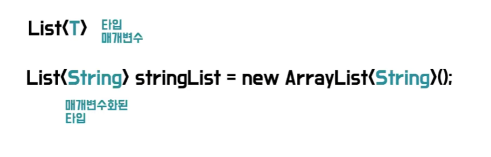

# 제네릭이란 무엇인가요?

- 자바에서 **제네릭(`Generic`)** 이란, **클래스 내부에서 사용할 데이터 타입을 외부에서 저장하는 기법**을 의미하며, 객체별로 다른 타입의 자료가 저장될 수 있도록 한다.
- **컴파일 타임에 타입을 체크함으로써 코드의 안전성을 높여주는 기능을 가지고 있다.**



- 제네릭은 다이아몬드 연산자라고 하는 `<>` 꺾쇠 괄호 키워드를 사용한다.
- 그리고 이 꺾쇠 괄호 안에 **식별자 기호**를 지정해 파라미터화할 수 있다.
- 이것을 마치 메서드가 매개변수를 받아 사용하는 것과 비슷하여 제네릭의 **타입 매개변수(parameter) / 타입 변수** 라고 부른다.

**타입 파라미터 기호 네이밍(암묵적인 규칙)**

| 타입          | 설명                      |
|-------------|-------------------------|
| < T >       | 타입(Type)                |
| < E >       | 요소(Element)             |
| < K >       | 키(Key)                  |
| < V >       | 리턴 값 또는 매핑된 값(Variable) |
| < N >       | 숫자(Number)              |
| < S, U, V > | 2번째, 3번째, 4번째에 선언된 타입   |

### 제네릭을 사용했을 때 이점

1. **컴파일 타임에 강력한 타입 검사를 통해 예외 방지**
    - 제네릭이 나오기 전 자바 1.5 이전에는 `Object` 를 사용해 제네릭과 비슷하게 구현했다.
    - 이럴 경우 개발자가 일일이 타입 변환을 시도해야 하며, 실수할 가능성이 존재한다.
    - 하지만 제네릭을 사용하면 컴파일 타임에 미리 에러를 잡아주기 때문에 실수를 사전에 방지할 수 있다.

2. **불필요한 캐스팅 제거**
   - 제네릭 없이 `Object`를 사용하면 매번 다운 캐스팅을 통해 객체를 가져와야 한다.
   - 제네릭을 사용하면 미리 타입을 지정하여 **제한하기 때문에** 형 변환의 번거로움을 줄일 수 있다.

<br>

## 변성(variance)

```java
List<Object> objectList = new ArrayList<Integer>();
```
**이 코드는 가능할까?** `Integer`는 `Object`의 하위 타입이지만 컴파일 오류가 발생한다.

```java
Object[] objectArr = new Integer[1];
```
이와 같이 배열에서는 `Integer`가 `Object`의 하위 타입이 성립이 된다. 이를 **공변**이라 한다.

하지만 제네릭 같은 경우는 `Object`와 `Integer`를 서로 관계가 없다고 보는데 이를 **무공변 또는 불공변**이라고 한다.

### 무공변(Invariance) - < T >
- **S**와 `T`가 서로 관계가 없다.
  - **List< S >** 와 `List<T>`는 서로 다른 타입이다. 

### 공변(Covariance) - <? extends T>

- 상위 타입에서 하위 타입으로 형 변환이 가능한 경우 타입을 공변 타입으로 간주한다.
- **S**가 `T`의 하위 타입이면
  - **S[]** 는 `T[]`의 하위 타입이다.
  - **List< S >** 는 `List<T>`의 하위 타입이다.

### 반공변(Contravariance) - <? super T>

- 하위 타입에서 상위 타입으로 형 변환이 가능한 경우 타입을 반공변 타입으로 간주한다.
  - **S**가 `T`의 하위 타입이면
    - `T[]`는 **S[]** 의 하위 타입이다.(공변의 반대)
    - `List<T>`는 **List< S >** 의 하위 타입이다.(공변의 반대)

<br>

## 제네릭 와일드카드

- 제네릭은 `extends`와 `super` 키워드를 이용해 클래스 상속 관계에서 타입을 하위 타입으로 제한할지, 상위 타입으로 제한할지 타입을 제한할 수 있다.
- `extends`는 타입 파라미터에 특정 타입의 **하위 타입만을 허용**하도록 지정할 때 사용한다.
- `super`는 타입 파라미터에 특정 타입의 **상위 타입만을 허용**하도록 지정할 때 사용한다.

| 와일드 카드            | 네이밍                                        | 설명                                                        |
|-------------------|--------------------------------------------|-----------------------------------------------------------|
| <?>               | `Unbounded wildcards`                      | 제한 없음(모든 타입 가능)                                           |
| <? **extends** U> | `Upper Bounded Wildcards`<br/> 상한 경계 와일드카드 | - 상위 클래스 제한 (`U`와 그 자손들만 가능) <br/> - 상한이 `U`라 상한 경계라고 한다. |
| <? **super** U>   | `Lower Bounded Wildcards`<br/> 하한 경계 와일드카드 | - 하위 클래스 제한 (`U`와 그 조상들만 가능) <br/> - 하한이 `U`라 하한 경계라고 한다. |

### extends / super 사용시기

- 언제 `<? extends T>`를 사용하고, `<? super T>`를 사용해야 할까?
- **PECS**
  - **Producer-Extends / Consumer-Super**의 약자다.
  - 외부에서 온 데이터를 생산(`Producer`)한다면 `<? extends T>`를 사용한다.(하위 타입으로 제한)
  - 외부에서 온 데이터를 소비(`Consumer`)한다면 `<? super T>`를 사용한다.(상위 타입으로 제한)


<br>

### 참고
- [참고 블로그](https://inpa.tistory.com/entry/JAVA-%E2%98%95-%EC%A0%9C%EB%84%A4%EB%A6%ADGenerics-%EA%B0%9C%EB%85%90-%EB%AC%B8%EB%B2%95-%EC%A0%95%EB%B3%B5%ED%95%98%EA%B8%B0#%EC%A0%9C%EB%84%A4%EB%A6%AD_%EC%99%80%EC%9D%BC%EB%93%9C_%EC%B9%B4%EB%93%9C)
- [참고 블로그](https://inpa.tistory.com/entry/JAVA-%E2%98%95-%EC%A0%9C%EB%84%A4%EB%A6%AD-%EC%99%80%EC%9D%BC%EB%93%9C-%EC%B9%B4%EB%93%9C-extends-super-T-%EC%99%84%EB%B2%BD-%EC%9D%B4%ED%95%B4#%EC%9E%90%EB%B0%94%EC%9D%98_%EA%B3%B5%EB%B3%80%EC%84%B1_/_%EB%B0%98%EA%B3%B5%EB%B3%80%EC%84%B1)
- [참고 동영상](https://www.youtube.com/watch?v=w5AKXDBW1gQ)