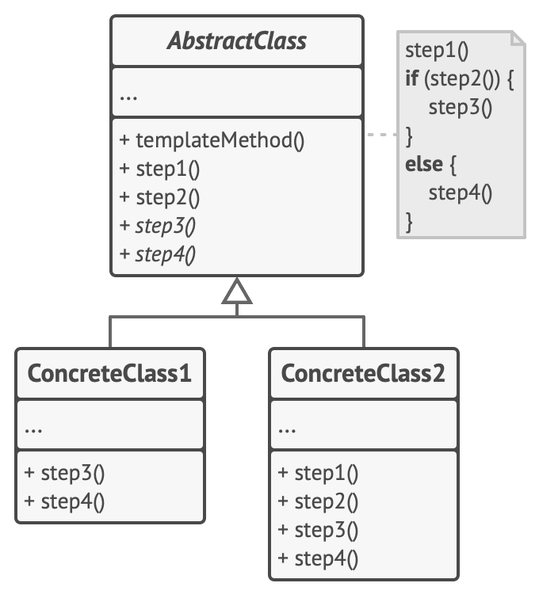

# 상속을 이용한 대표적인 디자인 패턴은 무엇인가요?

- 상속을 이용한 대표적인 디자인 패턴은 [템플릿 메서드 패턴](https://github.com/genesis12345678/TIL/blob/main/Spring/advanced/templateMethodPattern/TemplateMethodPattern.md#%ED%85%9C%ED%94%8C%EB%A6%BF-%EB%A9%94%EC%84%9C%EB%93%9C-%ED%8C%A8%ED%84%B4)이다.

# 템플릿 메서드 패턴에 대해 설명해 주세요.

- **템플릿 메서드 패턴**은 **여러 클래스에서 공통으로 사용하는 메서드를 템플릿화하여 상위 클래스에서 정의하고, 하위 클래스마다 세부 동작 사항을 다르게 구현하는 패턴이다.**
- **변하지 않는 기능(템플릿)은 상위 클래스에 만들어두고, 자주 변경되며 확장할 기능은 하위 클래스에서 만들도록**하여, 상위의 메서드 실행 동작 순서는 고정하면서, 세부 
    실행 내용은 다양화 될 수 있는 경우에 사용된다.
- 전체적으로는 동일하면서 부분적으로는 다른 구문으로 구성된 메서드의 코드 중복을 최소화할 때 유용하다.

> 디자인 패턴에서의 템플릿은 **변하지 않는 것**을 의미한다.

- **추상 클래스**는 알고리즘의 단계들의 역할을 하는 메서드들을 선언하며, 이러한 메서드를 특정 순서로 호출하는 실제 템플릿 메서드도 선언한다. 단계들은 `abstract`로 선언되거나 일부 디폴트 구현을 갖는다.
- **구상 클래스**들은 모든 단계들을 오버라이드 할 수 있지만, 템플릿 메서드 자체는 오버라이드 할 수 없다.

- **[장점]**
  - 상위 클래스로 로직을 공통화하여 중복 코드를 줄일 수 있다.
  - 자식 클래스의 역할을 줄여 핵심 로직의 관리가 용이하다.
  - 코드를 객체지향적으로 설계할 수 있다.
- **[단점]**
  - 추상 메서드가 많아지면서 클래스 관리가 어려워질 수 있다.
  - 로직에 변화가 생겨 상위 클래스를 수정할 때, 모든 서브 클래스의 수정이 필요할 수도 있다.
  - 하위 클래스를 통해 디폴트 단계 구현을 억제하여 [리스코프 치환 법칙](https://github.com/genesis12345678/TIL/blob/main/Java/OOP/solid/solid.md#lsp---%EB%A6%AC%EC%8A%A4%EC%BD%94%ED%94%84-%EC%B9%98%ED%99%98-%EB%B2%95%EC%B9%99)을 위반할 수 있다.

 

### 참고
- [참고 블로그](https://inpa.tistory.com/entry/GOF-%F0%9F%92%A0-%ED%85%9C%ED%94%8C%EB%A6%BF-%EB%A9%94%EC%86%8C%EB%93%9CTemplate-Method-%ED%8C%A8%ED%84%B4-%EC%A0%9C%EB%8C%80%EB%A1%9C-%EB%B0%B0%EC%9B%8C%EB%B3%B4%EC%9E%90)
- [참고 블로그](https://coding-factory.tistory.com/712)
- [참고 사이트](https://refactoring.guru/ko/design-patterns/template-method)