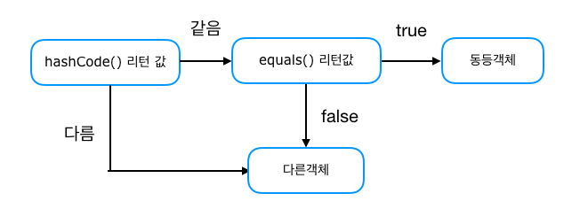

# equals 메서드와 hashCode 메서드에 대해서 설명해 주세요.

- **동일성**
  - 두 인스턴스가 **같은 존재인지** 판단하는 것으로, `==` 연산자로 두 인스턴스의 레퍼런스 변수를 비교한다.
- **동등성**
  - 두 인스턴스가 **같은 값으로 평가되는지** 확인하는 것으로, `equals()` 메서드를 오버라이딩해 어떤 조건에서 동등하다고 판단할지 정해줄 수 있다.
  - 모든 클래스는 `Object`를 상속받고, `Object` 클래스에 `equals()` 메서드가 있기 때문에 재정의(오버라이딩)가 가능하다.

**그렇다면 `equals()`만 재정의하면 모든 객체의 동등성이 보장이 되는 것일까?**

`equals()`만 재정의하면 `hash`값을 사용하는 자료구조(`HashSet`, `HashMap`, `HashTable`)에 저장할 시 문제가 될 수 있다.

`hashCode` 메서드는 **객체의 주소 값을 이용해서** 해싱(`hashing`) 기법을 통해 해시 코드를 만든 후 반환한다. 
때문에 서로 다른 두 객체는 같은 해시 코드를 가질 수 없고, 해시코드는 **객체의 지문** 이라고도 한다.

- `hash` 값을 사용하는 자료구조는 위와 같은 과정을 거쳐 저장된다.
- 예를 들어 필드의 값이 완전히 같은 두 객체를 `HashSet`에 저장해서 개발자는 1개가 저장될 것이라고 기대했다.
- 하지만 클래스에서 `hashCode()`를 오버라이딩 하지 않아 `Object` 클래스의 `hashCode` 메서드가 사용되었고, `equals`로 비교도 하기 전에
    서로 다른 `hashCode` 메서드의 리턴 값으로 인해 다른 객체로 판단되어 `HashSet`에는 2개의 객체가 저장된다.
- 이러한 오류를 방지하기 위해 `hashCode` 메서드도 재정의하여 두 객체의 특정 필드값이 같을 경우 같은 해시코드를 갖게 하도록 할 수 있다.

자바에서 미리 정의된 클래스를 저장할 때는 문제가 되지 않지만, 개발자가 직접 정의한 클래스로 데이터를 저장할 때는 `equals`와 `hashCode`를 재정의하여
오류를 방지할 수 있다.

 

### 참고
- [참고 블로그](https://velog.io/@rg970604/JAVA-Equals%EC%99%80-HashCode%EB%A5%BC-%EC%9E%AC%EC%A0%95%EC%9D%98%ED%95%98%EB%8A%94-%EC%9D%B4%EC%9C%A0)
- [참고 블로그](https://inpa.tistory.com/entry/JAVA-%E2%98%95-equals-hashCode-%EB%A9%94%EC%84%9C%EB%93%9C-%EA%B0%9C%EB%85%90-%ED%99%9C%EC%9A%A9-%ED%8C%8C%ED%97%A4%EC%B9%98%EA%B8%B0)