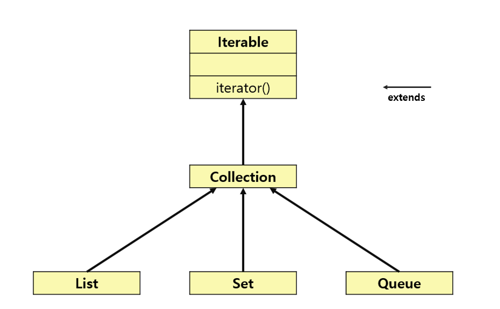

# Iterator와 Iterable의 차이는 무엇인가요?

- `Iterator`와 `Iterable`은 컬렉션 프레임워크에서 사용되는 개념이다.



- 자바의 컬렉션 프레임워크는 컬렉션에 저장된 요소를 읽어오는 방법을 `Iterator` 인터페이스로 표준화하고 있다.
- `Collection` 인터페이스를 상속받은 자료구조 `List`, `Set`, `Queue`는 `Collection` 상위에 있는 `Iterable` 인터페이스의 `Iterator` 기능을 사용할 수 있다.

**Iterator 인터페이스가 제공하는 메서드**
- `hasNext()` : 다음 요소가 없으면 `false` 반환
- `next()` : 다음 요소 반환
- `remove()` (default) : 마지막 요소 제거

```java
import java.util.ArrayList;
import java.util.Iterator;
import java.util.List;

public class Main {
    public static void main(String[] args) throws InterruptedException {

        List<Integer> list = new ArrayList<>();
        for (int i = 1; i <= 10; i++) {
            list.add(i);
        }

        Iterator<Integer> iter = list.iterator();
        while (iter.hasNext()) {
            System.out.print(iter.next() + " ");
        }
    }
}

// 1 2 3 4 5 6 7 8 9 10
```
(여기서 자바는 향상된 for문을 사용하도록 권장한다. 향상된 for문(`Enhanced for`)을 사용하면 같은 성능을 유지하면서도 코드의 명확성을 확보하고 발생할 수 있는 버그를 예방해준다.)

- `ArrayList`는 `List` 인터페이스의 구현체
- `List`는 `Collection`을 상속
- `Collection`은 `Iterable`을 상속
- `ArrayList` -> `List` -> `Collection` -> `Iterable`

> **정리**
> 
> - `Iterable` 인터페이스는 하위 클래스에서 `Iterator`의 생성을 강제하는 역할을 한다.
> - `Iterable`을 상속받은 `Collection`의 하위 클래스들은 모두 `Iterator`를 가지고 있다.
> - `Iterator`는 `hasNext()`, `next()` 등을 구현하고 있기 때문에 이를 활용하여 컬렉션의 각 요소에 접근할 수 있다.

<br>

### 참고
- [참고 사이트](https://www.tcpschool.com/java/java_collectionFramework_iterator)
- [참고 블로그](https://girawhale.tistory.com/17)
- [참고 블로그](https://wildeveloperetrain.tistory.com/209)
- [참고 블로그](https://devlog-wjdrbs96.tistory.com/84)