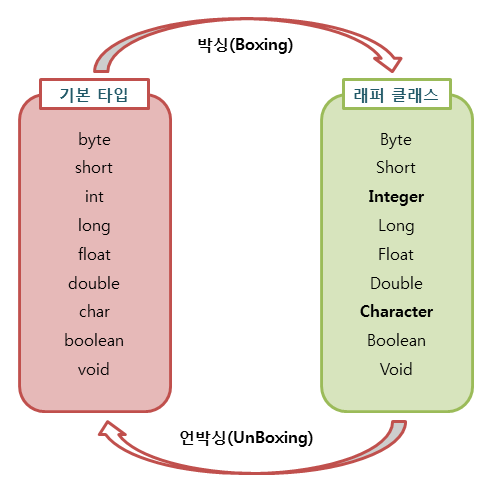

# Wrapper 클래스에 대해서 설명해 주세요.

- 자바는 객체지향 프로그래밍이고, 자바의 자료형은 **기본 타입(primitive type)** 과 **참조 타입(reference type)** 으로 나누어진다.
- 기본 타입은 객체가 아니기 때문에 메서드와 `null` 값을 가질 수 없고, 컬렉션 프레임워크, 제네릭에도 사용할 수 없다.
- 자바는 `java.lang` 패키지에서 제공되는 **래퍼 클래스**로 기본 타입에 해당하는 데이터를 객체로 포장해주는 기능을 제공한다.
- 래퍼 클래스를 사용하면 기본 타입을 객체처럼 다룰 수 있어 다양한 메서드 제공, `null`값 허용 등 편리하게 사용할 수 있다.
- 래퍼 클래스는 **불변**이며, 객체이므로 `eqauls`로 값을 비교해야 한다.
- 불변 객체이기 때문에 기존 래퍼 클래스는 변하지 않고 항상 새로운 인스턴스를 생성한다.

## 박싱과 언박싱



- 기본 타입의 데이터를 래퍼 클래스의 인스턴스로 변환하는 과정을 **박싱(`Boxing`)** 이라고 한다.
- 래퍼 클래스의 인스턴스에 저장된 값을 다시 기본 타입의 데이터로 꺼내는 과정을 **언박싱(`UnBoxing`)** 이라고 한다.
- `Xxx.valueOf()` : 박싱
- `Xxxvalue()` : 언박싱
- **parseXxx()** vs **valueOf()**
  - `parseXxx()` : 기본형 반환
  - `valueOf()`: 래퍼형 반환

### 오토박싱과 오토언박싱

- 자바 1.5부터 박싱과 언박싱이 필요한 상황에서 자바 컴파일러가 이를 자동으로 처리해준다.

```java
String str = "100";

//String -> Integer
Integer integer = Integer.valueOf(str); //박싱

//Integer -> int
int intValue = integer.intValue(); //언박싱

//int -> Integer
Integer integer1 = Integer.valueOf(intValue); //박싱

        
//Integer -> int (오토 언박싱)
int intValue1 = integer;

//int -> Integer (오토 박싱)
Integer integer2 = intValue;
```

- 대입해 준 것만으로 박싱과 언박싱이 자동으로 이루어진다.

> **편의성을 위해 오토 박싱과 오토 언박싱이 제공되지만, 내부적으로 추가 연산 작업을 거치게 된다.**<br>
> 따라서 불필요한 오토 캐스팅이 일어나는 일은 최소화하고, 동일한 타입 연산이 이루어지도록 구현하는 습관을 가지는 것이 좋다.


<br>


### 참고
- [참고 블로그](https://inpa.tistory.com/entry/JAVA-%E2%98%95-wrapper-class-Boxing-UnBoxing)
- [참고 블로그](https://gyoogle.dev/blog/computer-language/Java/Auto%20Boxing%20&%20Unboxing.html)
- [참고 사이트](https://www.tcpschool.com/java/java_api_wrapper)