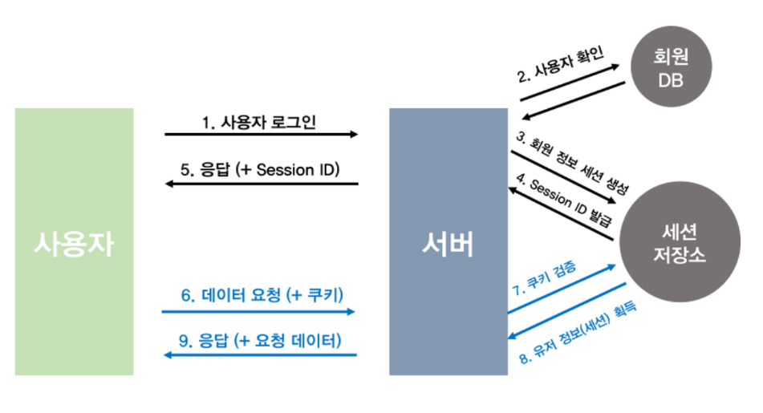

# 쿠키와 세션에 대해서 설명해 주세요.

- [쿠키(Cookie)]()는 클라이언트(로컬)에 저장되는 키와 값이 들어있는 작은 데이터 파일이다.
- 쿠키는 클라이언트에 저장되어 필요시 정보를 참조하거나 재사용할 수 있다.
- [세션(Session)](https://github.com/genesis12345678/TIL/blob/main/Spring/springmvc_2/login_1/v2/session/login_session.md#%EC%84%B8%EC%85%98%EC%9D%84-%EC%82%AC%EC%9A%A9%ED%95%98%EC%97%AC-%EB%A1%9C%EA%B7%B8%EC%9D%B8-%EC%B2%98%EB%A6%AC%ED%95%98%EA%B8%B0)은 일정 기간 동안 같은 사용자(클라이언트)로부터 들어오는 일련의 요구를 하나의 상태로 보고 그 상태를 일정하게 유지시키는 기술이다.
- 세션은 쿠키를 기반으로 하지만 쿠키와 다르게 **서버 측에서 저장하고 관리한다.**
- 서버는 세션 ID를 이용해 클라이언트를 구분하며, 웹 브라우저가 서버에 접속해 브라우저를 종료할 때가지 세션을 유지한다.

**쿠키와 세션 차이**
- `쿠키`는 클라이언트에 저장되지만, **세션**은 서버에 저장된다.
- **세션**은 서버에 저장되므로 서버의 자원을 사용한다.
- `쿠키`는 클라이언트에 저장되므로 서버의 자원을 사용하지 않는다는 이점이 있다.
- 보안면에서는 **세션**이 더 우수하다. `쿠키`는 정보를 직접 저장하고 요청을 보낼 수 있다. 만약 `쿠키`에 주민등록번호 같은 민감한 정보를 그대로 담아 HTTP 요청을 보낸다고 하면, 중간에 정보를 스니핑 당할 수도 있다.
- **세션**은 `쿠키`를 이용해 `쿠키`에 **세션 ID**만 저장하고 서버에서 **세션**을 처리하기 때문에 비교적 보안성이 좋다.
- `쿠키`는 만료시간 동안 파일로 저장되므로 브라우저를 종료해도 정보가 남아있다.
- **세션**은 브라우저가 종료되면 만료시간에 상관없이 삭제된다.

 

### 참고
- [참고 블로그](https://code-lab1.tistory.com/298)