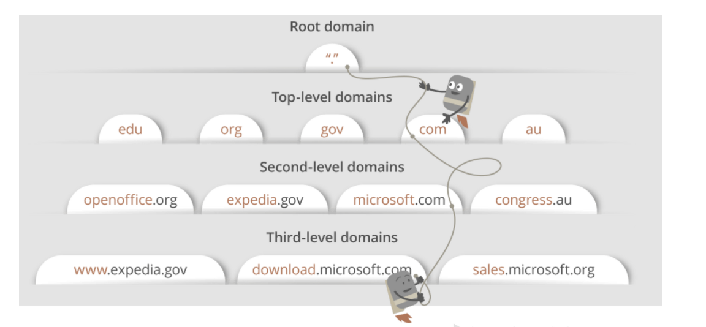
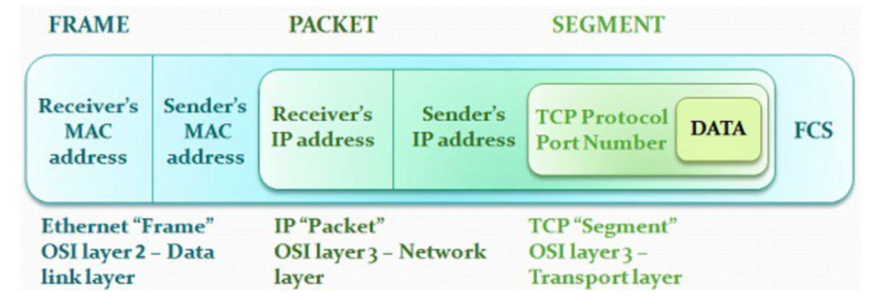

# 웹 브라우저에 google.com 을 치는 순간 일어나는 일을 설명해 주세요.

1. URL을 처리하기 위한 네트워크 요청이 브라우저에서 생성된다.
2. 요청이 네트워크를 통해 Google 서버로 전송된다.
3. Google 서버는 요청을 받아 HTML, CSS, Javascript 등의 웹 페이지 자원을 브라우저에 전송한다.
4. 브라우저는 전송된 자원을 통해 웹 페이지를 구성하고 표시한다.
5. 사용자는 렌더링 된 웹 페이지를 보고 웹 페이지의 내용을 탐색할 수 있다.

## 1. 브라우저 캐시 체크

- 일단 브라우저는 보통 [DNS](https://github.com/genesis12345678/TIL/blob/main/interview/network/1_10/DNS.md#dns%EA%B0%80-%EB%AC%B4%EC%97%87%EC%9D%B8%EA%B0%80%EC%9A%94)를 체크하지만, 현대 브라우저에서는 여러 **캐시**들을 거치게 된다.
1. **브라우저 캐시**
   - 기존에 google.com 을 방문한 적이 있다면 빠르게 접근할 수 있는 내용들이 다 들어가 있다.
2. **OS 캐시**
   - 1번째에서 찾을 수 없었다면, OS 캐시를 찾아보게 된다.
   - 말 그대로 운영체제 안에 있는 캐시로 `systemcall`을 통해 그 내용에 접근할 수 있다.
3. **라우터 캐시**
4. **ISP(Internet Service Provider) 캐시**

이러한 캐시들은 인터넷 스피드를 최대한 빨리 하기 위해 있다.

## 2. DNS로 IP 주소 획득

- 위 과정에서 ISP 캐시에서까지 IP 주소를 찾을 수 없었다면, 이제 ISP의 DNS Server 에다가 DNS 쿼리를 보내야 한다.

## 3. 브라우저가 TCP/IP 프로토콜을 사용해 서버에 연결

- 이제 IP 주소를 알게 되면, [TCP/IP](https://github.com/genesis12345678/TIL/blob/main/interview/network/1_10/TcpIp4Layer.md#tcpip-4-%EA%B3%84%EC%B8%B5%EC%97%90-%EB%8C%80%ED%95%B4-%EC%84%A4%EB%AA%85%ED%95%B4-%EC%A3%BC%EC%84%B8%EC%9A%94)를 사용해 서버에 연결을 하려고 신호를 보낸다.
- 신호는 다음 그림과 같은 형식을 사용한다.
- **TCP 부분은 데이터를 잃지 않고 잘 보내는 방법을 담당하며, IP 부분은 주소에 맞게 잘 보내는 쪽을 담당한다.**

- TCP 연결은 [3-way handshake](https://github.com/genesis12345678/TIL/blob/main/interview/network/1_10/Handshake.md#3-way-handshake-4-way-handshake-%ED%9D%90%EB%A6%84%EC%97%90-%EB%8C%80%ED%95%B4%EC%84%9C-%EC%84%A4%EB%AA%85%ED%95%B4-%EC%A3%BC%EC%84%B8%EC%9A%94) 과정을 통해 연결한다.

## 4. Firewall & HTTPS/SSL

- TCP 연결을 하는 중, `Firewall`과 `HTTPS`나 `SSL`과 같은 접근 제한 방법이 있다.
- `Firewall`은 해커가 무자비한 서비스 트래픽을 보내는 경우를 대비해 `Firewall`을 설치해, 특정 IP 주소나 어떤 지역에서 접근해 오는 신호를 차단할 수 있다.
- `HTTP/SSL`은 클라이언트와 서버와의 암호화를 통해 중간에 누가 패킷을 엿듣는 것을 차단한다.

## 5. Load balancer

- **Load balancer**가 트래픽을 측정해 뒤에 있는 여러 대의 서버 중 트래픽을 받을 수 있는 서버에게 잘 보내준다.
- 이는 트래픽이 망가지거나 지연되지 않도록 해준다.

## 6. 웹 서버

- TCP 연결이 된 후, 이제 클라이언트는 데이터를 보내게 되고, 그 데이터는 "나에게 첫 페이지를 보내줘" 라는 신호와 함께 보내지게 된다.
- 여기에는 브라우저 버전과 종류, 쿠키(사용자 정보) 등의 내용이 보내지게 되며, 구글은 여기서 사용자에게 필요한 내용을 요청한 방식으로 보내주게 된다.
- 여기에는 내용과 함께 HTTP 상태 코드 또한 보내져, 성공 또는 실패 등의 정보를 알 수 있다.

## 7. HTML 컨텐츠 렌더링

- 이제 브라우저는 구글 서버에서 받은 HTTP 코드와 HTML을 통해 렌더링을 시작하며, 필요한 이미지나 다른 파일들이 있으면, 또 보내달라고 요청을 하며 사용자는 구글의 페이지를 보게 된다.

 

### 참고
- [참고 블로그](https://brunch.co.kr/@seungjoonlernnx/100)