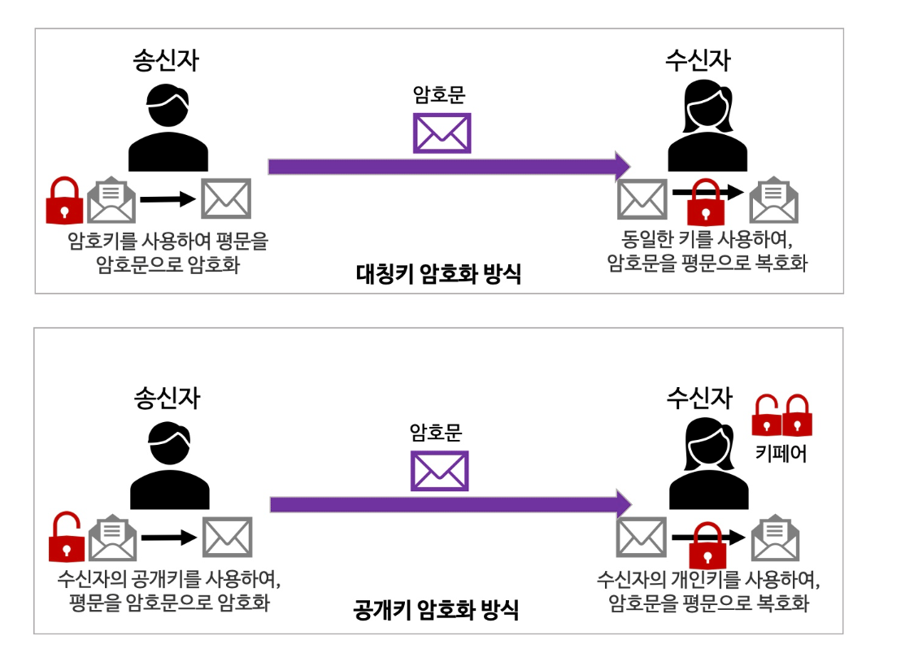
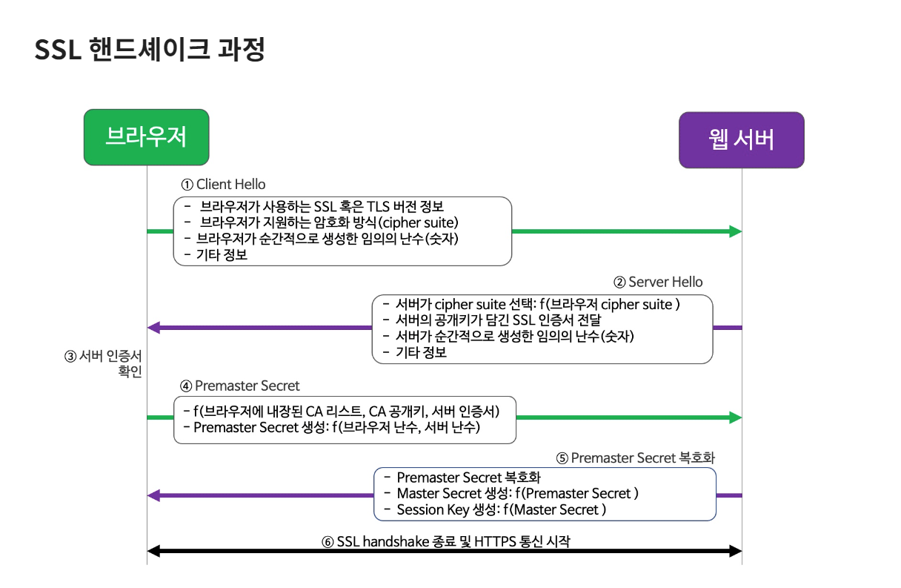

# HTTPS가 동작하는 방식에 대해 설명해 주세요.

- **HTTPS**는 암호화 프로토콜을 사용하여 통신을 암호화한다.
- HTTPS의 원천 기술로는 `SSL(Secure Socket Layer)`과 `TSL(Transport Layer Security)` 전송 기술이 있다.
- 단어에서 알 수 있듯, 안전한 계층을 웹 통신에 추가하는 방식이며, 이 기술을 수행하기 위해 웹 서버에 설치하는 것이 **SSL/TLS 인증서**이다.
- TLS는 SSL의 개선 버전으로, 최신 인증서는 대부분 TLS를 사용하지만 편의적으로 SSL 인증서라고 말한다.
- 웹 브라우저는 공신력 있는 인증서의 정보를 브라우저 내부에 보관하고 있으며, 접속하는 웹 사이트에 믿을만한 인증서가 설치되어 있는지 확인한다.

**대칭키 암호화 방식**
- 대칭키 암호화 방식이란 하나의 암호화키로 평문을 암호화하고, 다시 암호문을 평문으로 복호화할 때 사용하는 방식이다.
- 대칭키 암호화 방식은 키를 하나만 사용하는 간편함이 있지만, 키를 분실하거나 도난을 당하면 내 암호문을 누군가가 복호화하여 볼 수 있다는 치명적인 단점이 있다.

**공개키 암호화 방식**
- 공개키 암호화 방식은 공개키, 개인키 이렇게 두 개의 키를 한 쌍으로 각각 암호화/복호화에 사용한다.
- 일반적으로 공개키로 암호화한 것을 개인키로 복호화한다.
- 개인키를 먼저 만들고, 여기서 공개키를 파생하여 한 쌍이 키를 만들기 때문에 키페어(key pair)라고 부른다.
- 만약 같은 쌍이 아닌 다른 키를 사용하려 한다면 암호화/복호화가 불가능하다.

공개키 방식은 대칭키 방식에 비해 안전하지만, 계산 과정이 복잡하고 연산 도중 컴퓨터의 자원이 많이 사용한다. 그래서 공개키 방식과 대칭키 방식을 적절히 혼합하여 사용한다.

### 1. 클라이언트에 해당하는 브라우저가 먼저 웹 서버에 접속한다.
웹 사이트 접속에 HTTPS를 사용하는 브라우저는 다음 정보를 이 단계에서 보낸다.
- 브라우저가 사용하는 SSL 또는 TLS 버전 정보
- 브라우저가 지원하는 암호화 방식 모음(`cipher suite`)
- 브라우저가 순간적으로 생성한 임의의 난수(숫자)
- 만약 이전에 SSL 핸드 셰이크가 완료된 상태라면, 그떄 생성된 세션 아이디

`cipher suite`는 보안의 궁극적인 목표를 달성하기 위해 사용하는 방식을 패키지 형태로 묶어 놓은 것을 의미한다.
- 보안의 목표
  - 안전한 키 교환
  - 전달 대상 인증
  - 암호화 알고리즘
  - 메시지 무결성 확인 알고리즘

### 2. 웹 서버는 1번에 응답하면서 다음 정보를 클라이언트에 제공한다.
- 브라우저의 암호화 방식 정보 중에서 서버가 지원하고 선택한 암호화 방식(`cipher suite`)
- 서버의 공개키가 담긴 SSL 인증서, 인증서는 CA의 비밀키로 암호화되어 발급된 상태다.
- 서버가 순간적으로 생성한 임의의 난수(숫자)
- 클라이언트 인증서 요청(선택사항)

### 3. 브라우저는 서버의 SSL 인증서가 올바른지 확인한다.
- 대부분 브라우저에는 공신력 있는 CA들의 정보와 CA가 만든 공개키가 이미 설치되어 있다.
- 서버가 보낸 SSL 인증서가 정말 CA가 만든 것인지 확인하기 위해, 내장된 CA 공개키로 암호화된 인증서를 복호화한다.
- 정상적으로 복호화되었다면 CA가 발급한 것이 증명되는 것이다.
- 만약 등록된 CA가 아니거나, 등록된 CA가 만든 인증서처럼 꾸몄다면 이 과정에서 발각 되며 브라우저 경고를 보낸다.

### 4. 브라우저는 자신이 생성한 난수와 서버의 난수를 사용하여 premaster secret을 만든다.
- 웹 서버 인증서에 딸려 온 웹 사이트의 공개키로 이것을 암호화하여 서버로 전송한다.

### 5. 서버는 사이트의 비밀키로 브라우저가 보낸 permaster secret 값을 복호화한다.
- 복호화한 값을 master secret 값으로 저장한다.
- 이것을 사용하여 방금 브라우저와 만들어진 연결에 고유한 값을 부여하기 위한 세션키를 생성한다.
- 세션키는 대칭키 암호화에 사용할 키이다. 이것으로 브라우저와 서버 사이에 주고 받는 데이터를 암호화하고 복호화한다.

### 6. SSL 핸드셰이크를 종료하고 HTTPS 통신을 시작한다.
- 브라우저와 서버는 SSL 핸드셰이크가 정상적으로 완료하고, 이제는 웹상에서 데이터를 세션키를 사용해 암호화/복호화하며, HTTPS 프로토콜을 통해 주고받을 수 있다.
- HTTPS 통신이 완료되는 시점에서 서로에게 공유된 세션키를 폐기한다. 만약 세션이 여전히 유지되고 있다면 브라우저는 SSL 핸드셰이크 요청이 아닌 세션 ID만 서버에게 알려주면 된다.(과정 1번 참고)

> SSL 인증서에는 대칭키 방식과 공개키 방식 두 개 모두 사용하며, 모든 웹 콘텐츠의 전달을 공개키 방식으로 한다면 웹 서버와 브라우저에 많은 부담이 된다. 
> 그래서 SSL 핸드셰이크 단계까지는 공개키 방식, 그 이후의 HTTPS 통신은 대칭키 방식을 사용한다.

 

### 참고
- [참고 사이트](https://yozm.wishket.com/magazine/detail/1852/)
- [참고 영상](https://www.youtube.com/watch?v=H6lpFRpyl14)