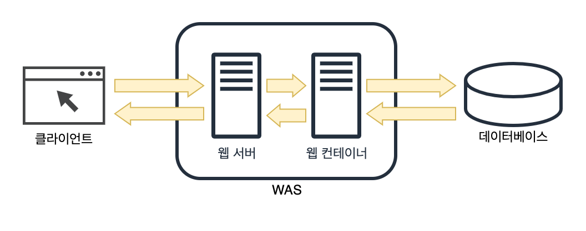

# 웹 서버와 웹 애플리케이션 서버의 차이는 무엇인가요?

- [웹 서버](https://github.com/genesis12345678/TIL/blob/main/Spring/springmvc_1/web_application/web_application.md#%EC%9B%B9-%EC%84%9C%EB%B2%84web-server)란 HTTP 프로토콜을 기반으로 클라이언트가 웹 브라우저에서 어떠한 요청을 하면 그 요청을 받아 정적 컨텐츠를 제공하는 서버이다.
- 정적 컨텐츠란 단순 HTML 문서, CSS, 이미지, 파일 등 즉시 응답 가능한 컨텐츠이다.
- [WAS](https://github.com/genesis12345678/TIL/blob/main/Spring/springmvc_1/web_application/web_application.md#%EC%9B%B9-%EC%95%A0%ED%94%8C%EB%A6%AC%EC%BC%80%EC%9D%B4%EC%85%98-%EC%84%9C%EB%B2%84was---web-application-server)란 DB 조회 혹은 다양한 로직 처리를 요구하는 동적 컨텐츠를 제공하기 위해 만들어진 Application Server이다.
- HTTP 프로토콜을 기반으로 사용자 컴퓨터나 장치에 애플리케이션을 수행해주는 **미들웨어**로서, 주로 데이터베이스 서버와 같이 수행된다.
- WAS는 JSP, Servlet 구동환경을 제공해주기 때문에 서블릿 컨테이너 혹은 웹 컨테이너로 불린다.

- **WAS는 웹 서버와 웹 컨테이너의 역할을 모두 할 수 있다.**
- 여기서 컨테이너는 JSP, Servlet을 실행시킬 수 있는 소프트웨어를 말한다.
- 현재 WAS의 웹 서버도 정적인 컨텐츠를 처리하는 데 성능상 큰 차이가 없다.

> **꼬리 질문**
> - **_WAS만 사용하고 웹 서버를 굳이 안 써도 되지 않나요?_**
> 
> **1. 서버 부하 방지**
> - WAS와 웹 서버는 분리하여 서버의 부하를 방지해야 한다.
> - WAS는 DB 조회나 다양한 로직을 처리하고, 단순한 정적 컨텐츠는 웹 서버에서 처리해줘야 한다.
> - 정적 컨텐츠까지 WAS가 처리한다면 부하가 커지게 되고, 수행 속도도 느려질 것이다.
> 
> **2. 보안 강화**
> - SSL에 대한 암호화, 복호화 처리에 웹 서버를 사용할 수 있다.
> 
> **3. 여러 대의 WAS 연결 가능**
> - 로드 밸런싱을 위해서 웹 서버를 사용할 수 있다.
> - 여러 개의 서버를 사용하는 대용량 웹 애플리케이션의 경우 웹 서버와 WAS를 분리하여 무중단 운영을 위한 장애 극복에 쉽게 대응할 수 있다.
> 
> **4. 여러 웹 애플리케이션 서비스 가능**
> - 하나의 서버에서 PHP, Java 애플리케이션을 함께 사용할 수 있다.
> 
> 이러한 이유들로 웹 서버를 WAS 앞에 두고 필요한 WAS 들을 웹 서버에 플러그인 형태로 설정하면 더욱 효율적인 분산 처리가 가능하다.

 

### 참고
- [참고 블로그](https://gmlwjd9405.github.io/2018/10/27/webserver-vs-was.html)