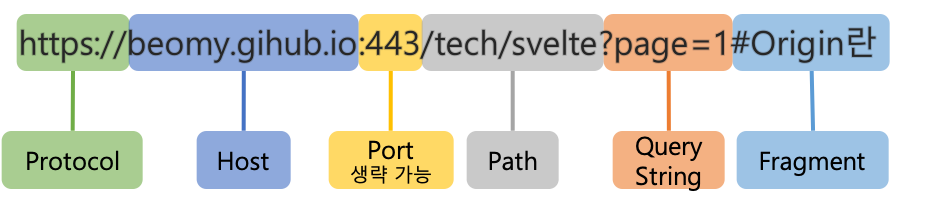

# CORS란 무엇인가요?

> 교차 출처 리소스 공유(Cross-Origin Resource Sharing, CORS)는 추가 HTTP 헤더를 사용하여, 한 출처에서 실행 중인 웹 애플리케이션이 다른 출처의 선택한 자원에 접근할 수 있는 권한을 부여하도록 브라우저에 알려주는 체제입니다. 웹 애플리케이션은 리소스가 자신의 출처(도메인, 프로토콜, 포트)와 다를 때 교차 출처 HTTP 요청을 실행합니다.
> 
> - [mdn web docs 설명](https://developer.mozilla.org/ko/docs/Web/HTTP/CORS)

- **CORS(Cross-Origin Resource Sharing)** 출처가 다른 자원들을 공유한다는 뜻으로, 한 출처에 있는 자원에서 다른 출처에 있는 자원에 접근하도록 하는 개념이다.
- 즉, 교차되는 출처 자원들의 공유이다. 
- 다른 출처에 있는 자원을 요청한다고 하면, 이를 교차 출처 요청 이라고 부른다.

## CORS가 존재하는 목적
- 무엇이 같은 출처이고, 무엇이 다른 출처인지, 또 다른 출처에서 요청했을 때 어떤 점이 위험한지 알기 위해서는 **출처**에 대해 알아야 한다.

### 출처란?

- 위 구성요소 중 **Protocol + Host + Port** 3가지가 같으면 동일 출처(`Origin`)라고 하고, 셋 중 한가지라도 다르면 다른 출처라고 한다.
- 다른 출처 요청일 경우, CORS 정책에 준수하여 요청해야만 정상적으로 응답을 받는다.

### 다른 출처 요청의 위험성

- ``, `<script>`, `<frame>` 등이 웹에 등장하면서, 페이지 로딩 이후에 브라우저에서 이러한 하위 자원들을 가져올 수 있게 되었다.
- 그러므로 동일 출처, 다른 출처 모두 호출이 가능하게 되었다.
- 예) CORS 정책이 없고 다른 출처 요청이 가능한 브라우저
  - 홈페이지 서핑 중, `<script>`가 심어진 페이지를 연다.
  - 페이지를 열면서 `<script>`가 실행되어 은행에 `delete/account`를 요청하도록 되어 있다.
  - AJAX 호출로 은행 API를 호출하여 나의 은행 계좌를 삭제해버리는 사고가 발생한다.

**다른 출처의 접근을 막기 위해 동일 출처 정책이 등장했다.**

### 동일 출처 정책(Same-origin policy)

- 동일 출처 정책은 다른 출처로부터 조회된 자원들의 읽기 접근을 막아 다른 출처 공격을 예방한다.
- 그러나 다른 출처에서 얻은 이미지를 담는 ``, 외부 주소를 담는 `<link>` 같은 여러 태그들을 허용한다.
- 동일 출처 정책의 정확한 구현 명세는 없지만 최신 브라우저들은 일정 규칙을 따르고 있다.

동일 출처 정책은 다른 출처 자원을 가져오는 것을 굉장히 제한적으로 허용했다. 관련 규칙들도 계속 늘어남에 따라, **다른 출처 리소스에 접근성을 높이기 위해서 CORS가 등장했다.**

 

### 참고
- [참고 블로그](https://escapefromcoding.tistory.com/724)