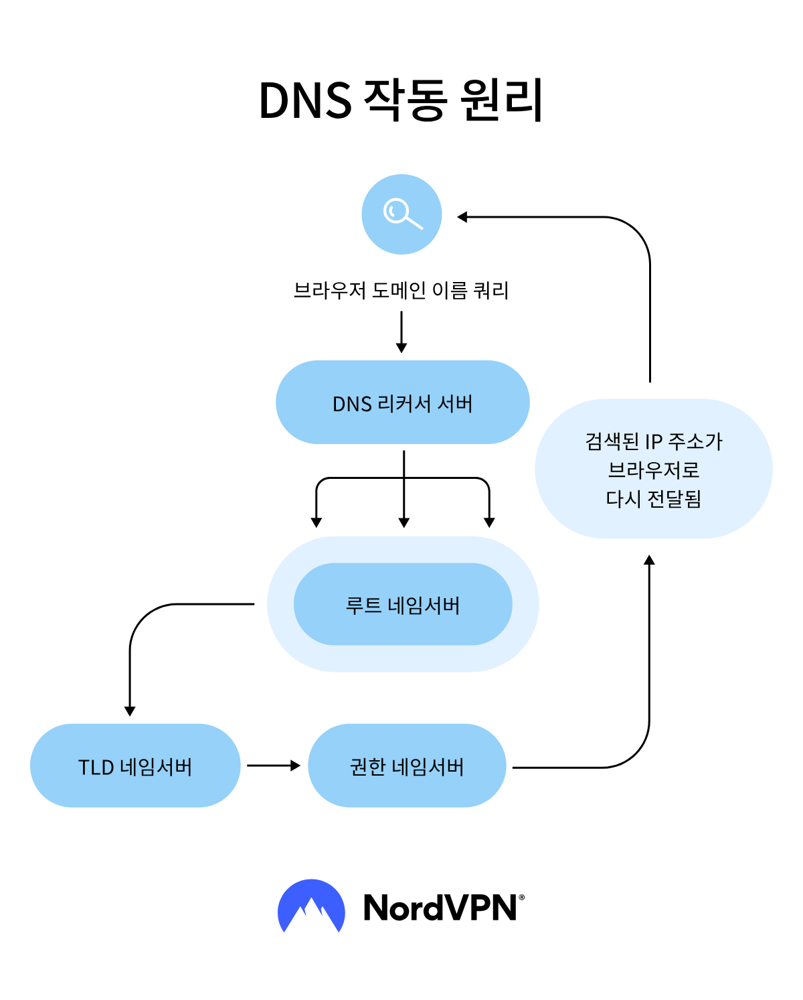

# DNS가 무엇인가요?

- **DNS(Domain Name System)** 란, 도메인 이름을 IP 주소로 변환하여 주는 시스템을 말한다.
- DNS 시스템에서는 도메인 이름과 IP가 서로 매핑되어 저장되어 있다. 사용자가 특정 도메인을 입력하면 그에 매치되는 IP 주소를 찾아서 접속할 수 있도록 해준다.
- 모든 장치는 IP 주소를 갖고 있고, 우리가 인터넷을 사용할 때 어떤 웹사이트에 접속하기 위해서는 이 IP 주소를 이용해야 한다.
- 하지만 우리는 IP 주소 대신에 URL 이라는 영문으로 이루어진 웹사이트 주소를 입력한다.
- www.example.com 와 같은 주소를 `192.0.0.0`와 같은 IP 주소로 변환시켜 주는 것이 DNS이다.

## DNS 서버의 종류

DNS 서버는 역할에 따라서 4가지로 나뉜다. 각각의 서버가 맡은 기능을 수행하여 전체 도메인 네임 시스템이 동작할 수 있게 한다.

**순환 DNS 서버(DNS resolver)**
- 요청 받은 도메인에 매치되는 IP 주소를 찾기 위해 계층적으로 DNS 쿼리를 수행한다.
- DNS 쿼리의 첫 단계에 해당하며, DNS 캐시를 저장하는 곳 이기도 하다.

**루트 DNS 서버(Root Name Server)**
- 순환 DNS 서버에서 처음으로 DNS 쿼리 요청을 보내는 서버이다.
- 해당 도메인의 확장자(`.com`, `.org`, `.net` 등)에 따른 TLD 네임 서버의 주소를 DNS Resolver에 응답해준다.

**최상위 도메인 DNS 서버(TLD Name Server)**
- 최상위 도메인(`.com`, `.org`, `.net` 등)에 대한 DNS 정보를 관리한다.
- 루트 DNS 서버와 권한 네임 서버의 중간 단계이다.

**권한 네임 서버(Authoritative Name Server)**
- 도메인의 IP 주소를 응답해주는 최종 단계 DNS 서버이다.
- 여기서 얻은 IP 주소가 순환 DNS 서버를 거쳐 브라우저까지 전달된다.

## DNS가 작동하는 방식

1. 사용자가 브라우저 주소창에 URL을 입력한다.
2. 브라우저가 입력된 도메인의 IP 주소를 알아내기 위해 운영체제를 거쳐 `DNS Resolver`에 요청을 보낸다.
3. `DNS Resolver`는 **로컬 DNS 캐시에 이전에 방문한 도메인 정보가 있는지 확인**한다. 만약 캐시에 기록이 있다면, 추가적인 DNS 조회가 필요하지 않으므로 이 단계에서 바로 IP 주소를 응답해 줄 수 있다.
4. 캐시에 정보가 없는 경우, `DNS Resolver`는 루트 DNS 서버에서 최상위 도메인 DNS 서버(`TLD`)의 IP 주소 정보를 알아낸다.
5. `DNS Resolver`는 최상위 도메인 DNS 서버(`TLD`)에 연결하여 권한 네임 서버의 IP 주소를 요청하여 받아낸다.
6. 최종적으로 `DNS Resolver`는 권한 네임 서버에서 도메인의 최종 IP 주소를 알아낸다. **이렇게 받아 온 IP 주소는 로컬 DNS 캐시에 저장되고**, 이후 같은 요청이 있다면 `DNS Resolver`에서 바로 응답이 가능해진다.
7. 받아온 최종 IP 주소를 다시 거꾸로 운영체제를 거쳐 브라우저로 전달한다. 사용자는 웹 브라우저를 통해 마침내 해당 IP 서버에 연결할 수 있다.

 

### 참고
- [참고 사이트](https://nordvpn.com/ko/blog/dns-explained/)