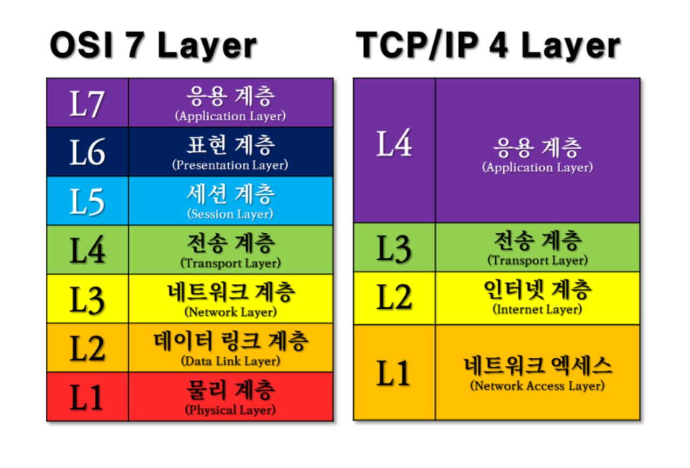

# TCP/IP 4 계층에 대해 설명해 주세요.

- TCP/IP 프로토콜 통신 과정에 초점을 맞추어, OSI 7 계층을 좀 더 단순화 시킨 계층이다.
- 계층은 네트워크 액세스, 인터넷, 전송, 애플리케이션 계층으로 이루어져 있다.
- 이러한 계층적인 구조는 다음과 같은 특징을 가지고 있따.
  - 각 계층별 처리 역할이 다르기 때문에, 계층별 간섭을 최소화할 수 있다.
  - 특정 계층에서 문제가 생기면, 해당 계층을 살펴보면 되기 때문에 유지 보수가 편리하다.
  - 다른 계층끼리는 데이터의 전달 과정을 알 필요가 없기 때문에, 데이터의 캡슐화와 은닉이 가능하다.

## 1계층 - 네트워크 계층(Network Access Layer)

- Node To Node 간의 신뢰성 있는 데이터 전송을 담당하는 계층이다.
- OSI 7 계층의 물리 계층과 데이터링크 계층의 역할을 이 계층이 담당한다.
- 알맞은 하드웨어로 데이터가 전달되도록 MAC 주소를 핸들링 하는것 뿐 아니라, 데이터 패킷을 전기신호로 변환하여 선로를 통하여 전달할 수 있게 준비 해준다.

## 2계층 - 인터넷 계층(Internet Layer)

- OSI 7 계층에서 네트워크 계층
- **IP를 담당하는 계층**으로, IP를 사용하여 데이터의 원천지(origin)와 목적지(destination)에 관한 정보를 첨부한다.
- IP는 복잡한 네트워크 망을 통하여 가장 효율적인 방법으로 데이터의 작은 조각들을 되도록 빨리 보내는 일을 한다.
- IP는 패킷 전달 여부를 보증하지 않고, **경로를 설정하여 어떻게든 빨리 보내도록 한다.**

| 프로토콜 | 설명                                                     |
|------|--------------------------------------------------------|
| IP   | 비연결의 서비스를 제공하며, 발신지와 목적지까지의 라우팅 경로를 설정                 |
| ICMP | IP제어와 메시지 기능을 담당                                       |
| ARP  | IP 주소를 이용해 상대방의 MAC 주소를 알아오는 프로토콜(브로드캐스트 요청, 유니캐스트 응답) |
| RARP | MAC 주소에 해당하는 IP 주소를 알아오는 프로토콜(브로드캐스트 요청, 유니캐스트 응답)     |

## 3계층 - 전송 계층(Transport Layer)

- OSI 7 계층에서 전송 계층
- [TCP/UDP](https://github.com/genesis12345678/TIL/blob/main/Http/network/network.md#tdp-udp)를 담당하는 계층 
- TCP는 IP 위에서 동작하는 프로토콜로, **데이터의 전달을 보증하고 보낸 순서대로 받게 해준다.**
- 즉, 순서가 맞지 않거나 중간에 빠진 부분을 점검하여 다시 요청하는 일을 담당한다.

## 4계층 - 응용 계층(Application Layer)

- OSI 7 계층에서 5, 6, 7(세션, 표현, 응용)계층의 기능을 담당한다.
- **HTTP/FTP를 담당하는 계층이며, 서버나 클라이언트 응용 프로그램이 이 계층에서 동작한다.**
- 우리가 알고 있는 브라우저나 텔넷같은 서비스가 이 계층에 동작한다.

| 프로토콜                                     | 설명                                 |
|------------------------------------------|------------------------------------|
| DNS(Domain Name System)                  | 인터넷에서 사용하는 이름을 해당 IP 주소로 변환해주는 서비스 |
| SNMP(Simple Network Management Protocol) | 네트워크 장비를 모니터링하고 제어하는 프로토콜          |
| FTP(File Transfer Protocol)              | TCP 환경에서 파일 전송 프로토콜                |
| TFTP(Trivial File Transfer Protocol)     | UDP 환경에서 파일 전송 프로토콜                |
| HTTP(HyperText Transfer Protocol)        | 웹상에서 정보를 주고받을 수 있는 프로토콜            |