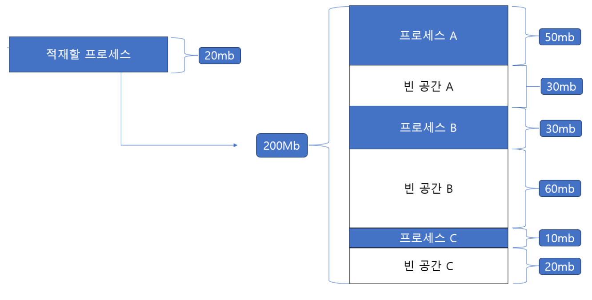
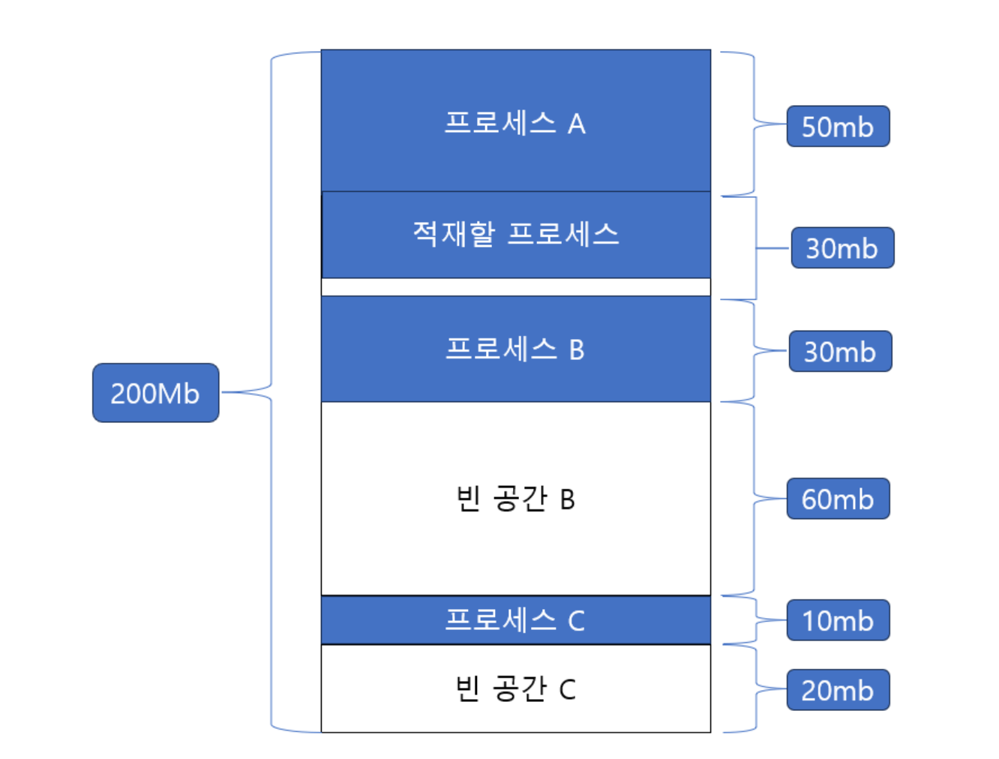
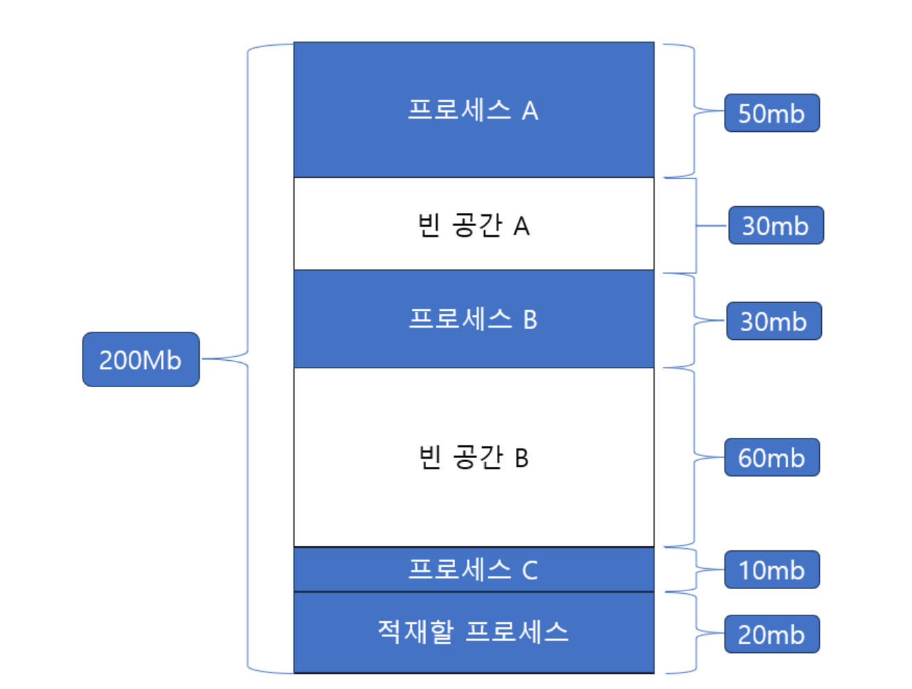
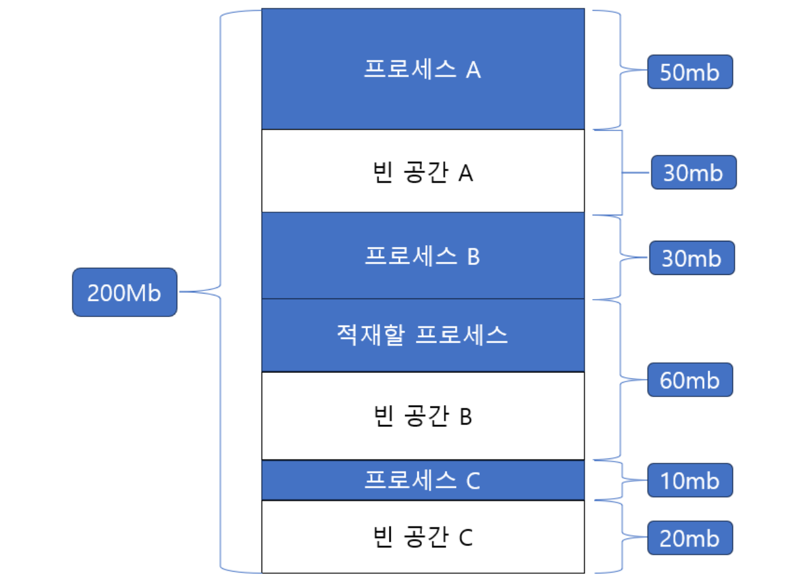

# First Fit, Best Fit, Worst Fit 에 대해 설명해 주세요.

- `Fit`은 **프로세스를 남아있는 메모리에 적합시키는 것**을 의미하며, 방법 별로 나눈 것이 `First`, `Best`, `Worst`이다.

- 위와 같이 메모리의 사용자 영역 총 200MB가 있고, 20MB 크기의 프로세스를 적재하는 상황을 **최초 적합, 최적 적합, 최악 적합**으로 적재하는 방식을 알아보자.

## 최초 적합(First Fit)

- 이름에서 알 수 있듯, 운영체제가 메모리 내의 빈 공간을 순서대로 검색하다가 첫 번째로 발견한 적절한 공간에 프로세스를 배치하는 방식이다.
- **장점**
  - 적합한 공간을 발견하는 즉시 할당을 진행하므로, 불필요한 검색을 최소화할 수 있어 메모리 할당 속도가 빠르다.

## 최적 적합(Best Fit)

- 운영체제가 메모리의 모든 빈 공간을 검색한 후, 프로세스가 적재될 수 있는 공간 중에서 **가장 작은 공간에 프로세스를 배치**하는 방식이다.
- 이 방식의 목표는 **메모리 내의 남은 공간, 즉 내부 단편화를 최소화 하는 것**이다.

## 최악 적합(Worst Fit)

- 운영체제가 메모리의 모든 빈 공간을 검색한 후, 프로세스가 적재될 수 있는 공간 중에서 **가장 큰 공간에 프로세스를 배치하는 방식**이다.
- 이 방식의 목표는 **큰 프로세스의 요청을 처리할 수 있는 큰 메모리 블록을 가능한 유지하는 것**이다.

 

### 참고
- [참고 블로그](https://taeyoungcoding.tistory.com/350)