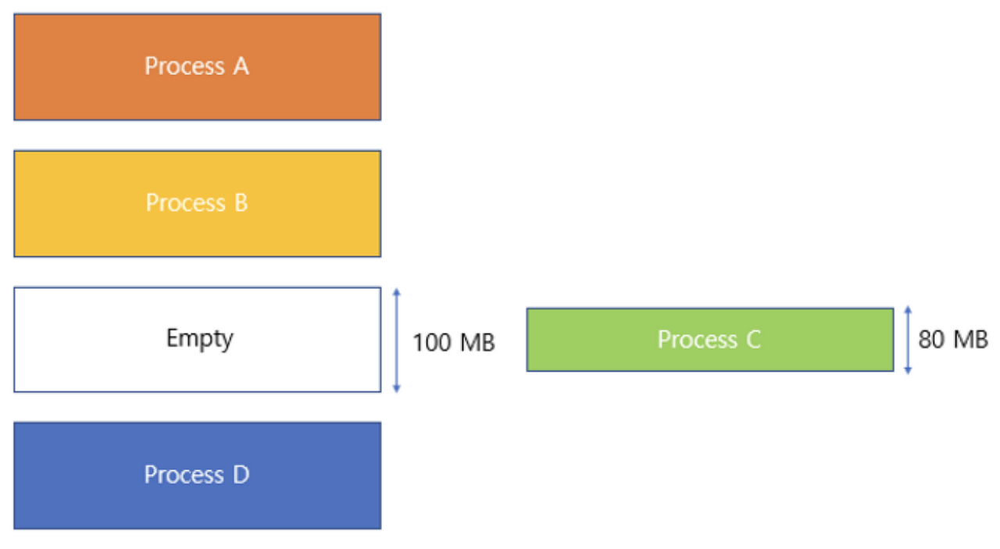
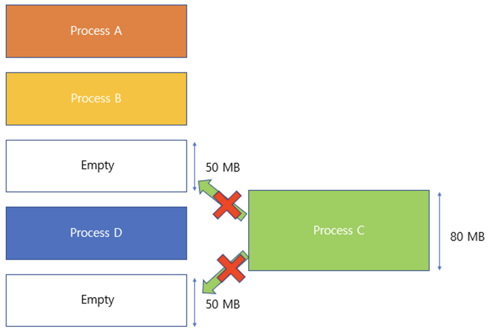
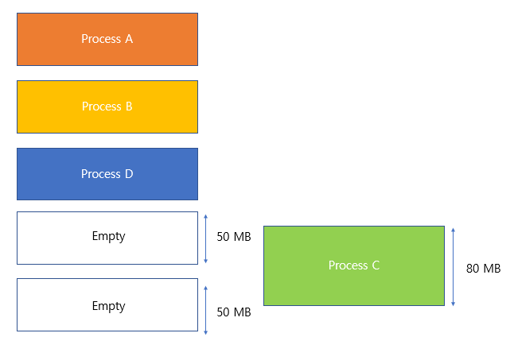
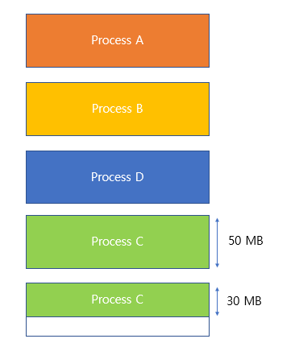

# 외부 단편화와 내부 단편화에 대해 설명해 주세요.

## 내부 단편화

- **내부 단편화(Internal Fragmentation)** 란, 주기억장치 내 사용자 영역이 실행 프로그램보다 커서 프로그램의 사용 공간을 할당 후 **사용되지 않고
    남게 되는 현상**을 말한다.

- 20MB의 여유 메모리가 존재하지만 `Process C`에게 할당되어 사용할 수 없다.
- 이렇게 남게 되는 메모리 용량이 너무 작아서 다른 프로세스가 사용하지 못하고 메모리가 낭비되는 것이 **내부 단편화**이다.

## 외부 단편화

- **외부 단편화(External Fragmentation)** 란, 남아있는 총 메모리 공간이 요청한 메모리 공간보다 크지만, **공간이 연속적(`contiguous`)이지 않아** 발생하는 현상이다.

- 총 100MB의 여유 메모리가 존재하지만, 연속적이지 않은 공간에 존재하여 80MB인 `Process C`를 실행시킬 수 없다.
- 이렇게 총 용량은 프로세스를 담기에 충분하지만 남아있는 공간이 연속적이지 못해서 프로세스를 할당하지 못하는 것을 **외부 단편화**라 한다.
- 압축(`Compaction`)을 이용해 해결할 수 있다.
  - `Compaction` : 흩어져 있던 공간을 하나의 연속적인 공간으로 합치는 기법
  - 구현이 복잡하다.

### 압축

- 외부 단편화 문제를 해결하기 위해 압축 기법을 사용할 수 있다.
- **압축 기법**은 주기억장치 내 분산되어 있는 단편화 된 공간들을 통합하여 **하나의 커다란 빈 공간을 만드는 작업을 의미한다.**

- 흩어져 있던 공간을 연속된 공간, 즉 하나의 공간으로 만들면서 기존에 할당할 수 없었던 프로세스를 할당할 수 있게 된다.

 

### 참고
- [참고 블로그](https://hojunking.tistory.com/109)
- [참고 블로그](https://code-lab1.tistory.com/54)