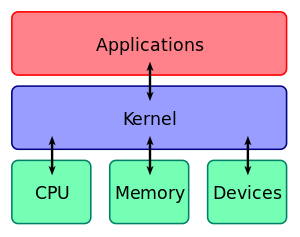

# 커널이란 무엇인가요?

- **커널(Kernel)** 은 **운영체제 중 항상 메모리에 올라가 있는** 운영체제의 핵심 부분으로써, **하드웨어와 응용 프로그램 사이에서** 인터페이스를 제공하는 역할을 하며,
  컴퓨터 자원들을 관리하는 역할을 한다.
- 커널은 인터페이스로써 응용 프로그램 수행에 필요한 여러가지 서비스를 제공하고, 여러가지 하드웨어(CPU, 메모리 등) 등의 리소스를 관리하는 역할을 한다.

- 커널은 항상 컴퓨터 자원들을 바라만 보고 있기 때문에 사용자의 상호작용은 지원하지 않는다.
- 사용자와의 직접적인 상호작용을 위해 프로그램을 제공하는데, 대표적으로 `쉘(shell)`이라는 명령어 해석기 등이 있다.