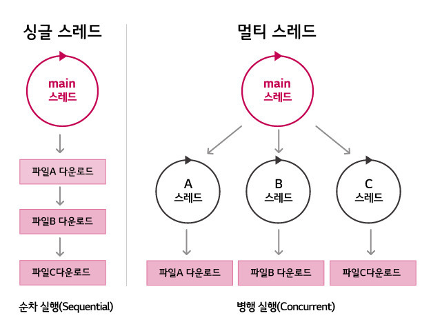
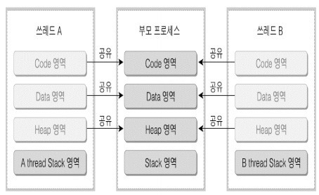
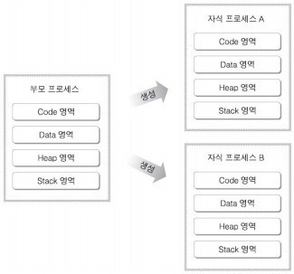
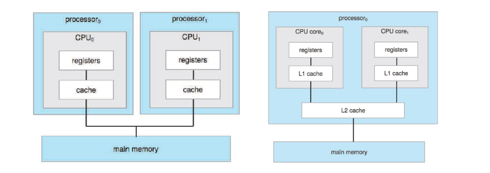
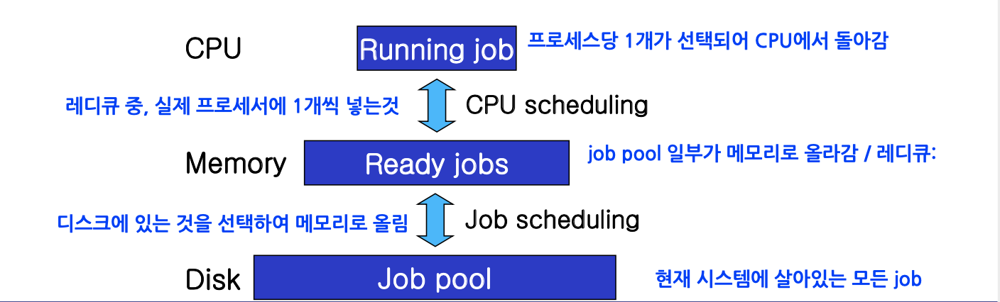
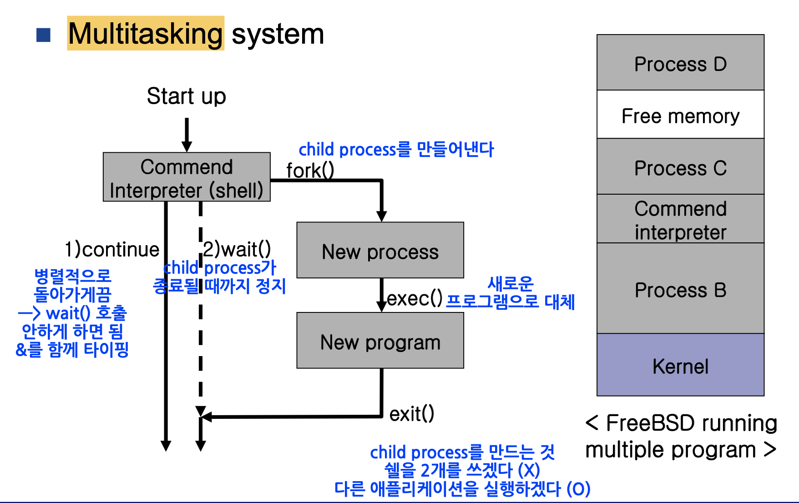

# 멀티 쓰레딩이란 무엇인가요?

- 일반적으로 **하나의 프로세스는 하나의 쓰레드**를 가지고 작업을 수행한다.
- 하지만 **멀티 쓰레드**란 하나의 프로세스 내에서 **둘 이상의 쓰레드가 동시에 작업을 수행하는 것**을 의미한다.
- **멀티 쓰레드 장점**
  - 하나의 프로세스 내에 다수의 실행 단위들이 존재하여 작업 수행에 필요한 자원들을 공유하기 때문에 **자원의 생성과 관리가 중복되는 것을 줄일 수 있다.**
  - 프로그램의 일부분(쓰레드)이 중단되거나 긴 작업을 수행하더라도 프로그램의 수행이 계속 되어 **사용자에 대한 응답성이 증가한다.**
- **멀티 쓰레드 단점**
  - **교착 상태**를 발생시킬 수 있다.
  - 동기화에 주의해야 한다.
  - 공유 메모리를 갖기 때문에, 하나의 쓰레드에 이상이 생기면 모든 쓰레드에 영향을 끼칠 수 있다.

 

# 멀티 프로세스란 무엇인가요?

- **멀티 프로세스**는 여러 개의 CPU를 사용하여 여러 프로세스를 동시에 수행하는 것을 의미한다.
- 각 프로세스 간 메모리 구분이 필요하거나 독립된 주소 공간을 가져야 할 경우 사용한다.

- **멀티 프로세스 장점**
  - 독립된 구조로 안정성이 높다.
  - 프로세스 중 하나에 문제가 생겨도 다른 프로세스에 영향을 주지 않아, 작업속도가 느려질 수는 있어도 정지되거나 하는 문제는 발생하지 않는다.
  - 여러 개의 프로세스가 처리되어야 할 때 동일한 데이터를 사용하고, 이러한 데이터를 하나의 디스크에 두고 모든 프로세서(CPU)가 이를 공유하면 비용적으로 저렴하다.
- **멀티 프로세스 단점**
  - 독립된 메모리 영역이기 때문에 작업량이 많을수록(`Context Switching`이 자주 일어나서 주소 공간의 공유가 잦을 경우) 오버헤드가 발생하여 성능저하가 발생할 수 있다.
  - `Context Switching` 과정에서 캐시 메모리 초기화 등 무거운 작업이 진행되고 시간이 소모되는 등 오버헤드가 발생한다.

 

# 멀티 프로세스 대신 멀티 쓰레드를 사용하는 이유는 무엇인가요?

- 운영체제가 시스템 자원을 효율적으로 관리하기 위해 쓰레드를 사용한다.
- 멀티 프로세스로 실행되는 작업을 멀티 쓰레드로 실행할 경우, **프로세스를 생성하여 자원을 할당하는 시스템 콜이 줄어들어 자원을 효율적으로 관리할 수 있다.**
- 프로세스 간의 통신보다 **쓰레드 간의 통신 비용이 적으므로** 작업들 간의 통신의 부담이 줄어들게 된다.

## 그렇다면 멀티 쓰레드가 무조건 좋을까요?
- 프로그래머의 역량에 따라 다를 수 있다.
- 쓰레드를 활용하면 자원의 효율성이 증가하기도 하지만, 쓰레드 간의 자원 공유는 **전역 변수**를 이용하므로 **동기화 문제**가 발생할 수 있다.
- 따라서, 프로그래머가 이를 잘 이해하고 있으면 멀티 쓰레드가 좋다.

 

# 멀티 프로세싱과 멀티 프로그래밍의 차이는 무엇인가요?

- **멀티 프로세싱**은 여러 개의 처리 장치, 즉 **여러 개의 CPU 코어가 동시에 작업을 처리하는 것**을 의미한다.
  - 여러 개의 프로세서가 **병렬로** 작업을 수행하므로, 단일 프로세스보다 빠른 처리 속도를 보장한다.

- **멀티 프로그래밍**은 단일 프로세스의 한번에 하나의 프로그램만 실행할 수 있는 문제를 해결하기 위해 나타났다.
  - 여러 개의 프로그램을 메모리에 올려놓고 **하나의 CPU에서 번갈아 가며** 동시에 실행시킨다.
  - 멀티 프로그래밍은 여러 개의 프로그램이 동시에 실행된다는 의미로, CPU 사용률을 극대화 시키는 데 목적을 두었다.

프로세서가 **입출력 작업의 종료를 대기할 동안 하나의 프로세서에서 다른 프로그램을 수행할 수 있도록 하는 것**이 멀티 프로그래밍이다.

 

# 멀티 태스킹이란 무엇인가요?

- `Task`란 운영체제에서 처리하는 작업의 단위 또는 정해진 일을 수행하기 위한 명령어 집합을 뜻한다.(`process`보다 확장된 개념)
- **멀티 태스킹**은 `task`를 `OS`의 스케줄링에 의해 **`task`를 번갈아가며 수행하는 것**을 의미한다.
- 여러 개의 `task`를 자주 번갈아가며 수행하므로 사용자는 동시에 여러 `task`가 수행되고 있다고 느끼게 된다.

 

# 멀티 태스킹과 멀티 쓰레딩에 대해 비교해 주세요.

- **멀티 쓰레딩**은 쓰레드들끼리의 자원 공유가 가능하며, 프로그래밍을 통해 구현 가능하다.
- 하지만 **멀티 태스킹**은 `OS`에서 지원하는 것으로 독립된 메모리를 가지며, 서로 간의 자원 공유가 이루어지지 않는다.
  - 자원 공유를 위해 별도의 `IPC(Inter-Process Communication)`를 구현해야 하여, 멀티 쓰레딩에 비해 운영체제에게 부담을 줄 수 있다.

## 그렇다면 멀티 쓰레딩이 더 좋은 건가요?

- 상황에 따라 다르다.
- **멀티 태스킹은 독립된 메모리를 가지기 때문에 독립된 수행이 가능하다는 이점이 있다.**
- 각각 적절하게 사용해야 한다.

 

### 참고
- [참고 블로그](https://velog.io/@hkh1213/%EB%A9%80%ED%8B%B0%EC%8A%A4%EB%A0%88%EB%94%A9%EC%9D%98-%EC%9E%A5%EC%A0%90-%EB%8B%A8%EC%A0%90)
- [참고 블로그](https://inpa.tistory.com/entry/%F0%9F%91%A9%E2%80%8D%F0%9F%92%BB-multi-programming-tasking-processing#%EB%A9%80%ED%8B%B0_%ED%94%84%EB%A1%9C%EA%B7%B8%EB%9E%98%EB%B0%8D_multi_programming)
- [참고 블로그](https://velog.io/@chy0428/OS-%EB%A9%80%ED%8B%B0%ED%94%84%EB%A1%9C%EA%B7%B8%EB%9E%98%EB%B0%8D-%EB%A9%80%ED%8B%B0%ED%94%84%EB%A1%9C%EC%84%B8%EC%8B%B1)