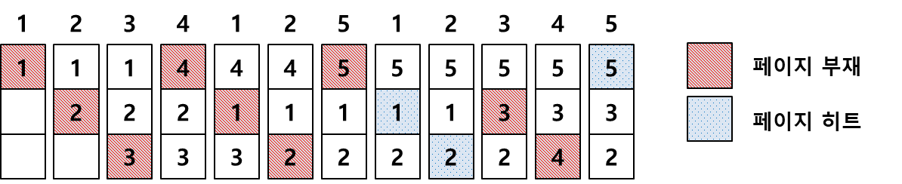
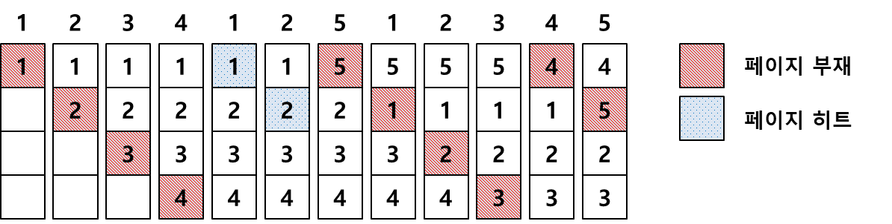
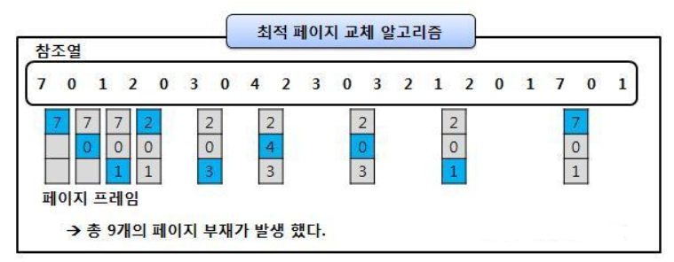
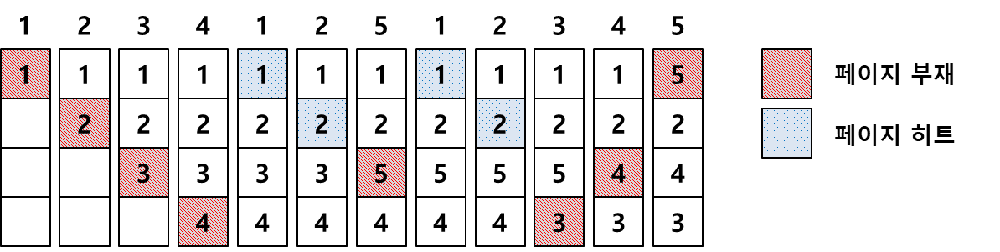
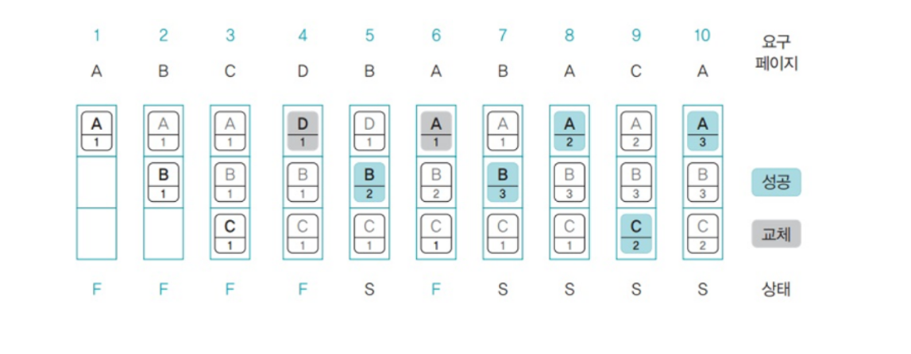
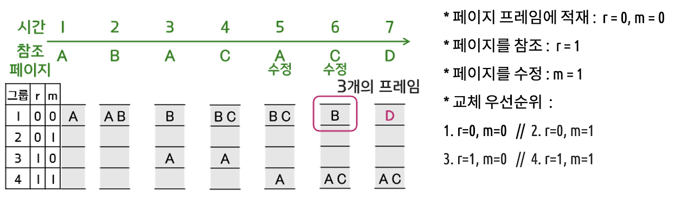

# 페이지 교체 알고리즘에 대해서 설명해 주세요.

- **_페이지 교체 알고리즘(Page Replacement Algorithm)_**
- 가상 메모리 기법을 구현하는 방식 중 하나인 요구 페이징 방식은 페이지 부재가 발생하게 된다.
- 페이지를 교체하는 작업은 오버헤드를 동반하므로 가능하면 페이지 교체가 적게 일어나는 것이 좋다.
- **페이지 부재(page fault)** 가 발생하면 요청된 페이지를 디스크에서 메모리로 읽어와야 한다.
- 이때 물리적 메모리에 빈 프레임이 존재하지 않을 수 있다. 이 경우 **물리적 메모리에 올라와 있는 페이지 중 하나를 선택해서 디스크의 스왑 영역으로 보내야 한다.**
- 이와 같은 과정을 **페이지 교체**라고 한다.

페이지 교체 알고리즘의 목표는 **페이지 부재율을 최소화**하는 것이다. 그러므로 가까운 미래에 참조될 가능성이 가장 적은 페이지를 선택해서 내보내는 것이 성능을 향상 시킬 수 있을 것이다.

| 종류         | 알고리즘        | 특징                                      |
|------------|-------------|-----------------------------------------|
| 간단한 알고리즘   | 무작위         | 무작위로 대상 페이지를 선정하여 스왑 영역으로 보낸다.          |
|            | FIFO        | 처음 메모리에 올라온 페이지를 스왑 영역으로 보낸다.           |
| 이론적 알고리즘   | 최적(Optimal) | 미래의 접근 패턴을 보고 대상 페이지를 선정하여 스왑 영역으로 보낸다. |
| 최적 근접 알고리즘 | LRU         | 시간적으로 멀리 떨어진 페이지를 스왑 영역으로 보낸다.          |
|            | LFU         | 사용 빈도가 적은 페이지를 스왑 영역으로 보낸다.             |
|            | NUR         | 최근에 사용한 적이 없는 페이지를 스왑 영역으로 보낸다.         |
|            | FIFO 변형     | FIFO 알고리즘을 변형하여 성능을 높인다.                |

 

## FIFO(First In First Out) 알고리즘
- **페이지 교체 시 물리적 메모리에 가장 먼저 올라온 페이지를 우선적으로 내보내는 알고리즘**
- 페이지의 향후 참조 가능성을 고려하지 않아 비효율적인 상황이 발생할 수 있다.

- 3개의 페이지 프레임과 9번의 페이지 부재, 3번의 페이지 히트가 발생했다.

- 4개의 페이지 프레임과 10번의 페이지 부재, 2번의 페이지 히트가 발생했다.
- **페이지 프레임을 더 많이 사용했는데 오히려 페이지 부재 횟수가 증가했다.**
- FIFO 알고리즘에서 메모리를 증가해도 페이지 부재가 증가하는 **FIFO의 이상 현상**이 발생할 수 있다.

## OPT(Optimal) 알고리즘

- **앞으로 가장 사용하지 않을 페이지를 가장 우선적으로 내보내는 알고리즘이다.**

- FIFO 알고리즘에 비해 페이지 부재의 횟수를 많이 감소시킬 수 있다.
- 하지만 실질적으로 페이지가 앞으로 잘 사용되지 않을 것이라는 보장이 없기 때문에 수행하기 어려운 알고리즘이다.

## LRU(Least Recently Used)

- **최근에 사용하지 않은 페이지를 가장 먼저 내보내려는 알고리즘이다.**
- 최근에 사용하지 않았으면, 나중에도 사용되지 않을 것이라는 아이디어에서 나왔다.
- OPT 알고리즘에 경우 미래 예측이지만, LRU 알고리즘의 경우는 과거를 보고 판단하므로 실질적으로 사용이 가능한 알고리즘이다.
- OPT 알고리즘 보다는 페이지 부재가 더 일어날 수 있지만, 실제로 사용할 수 있는 페이지 교체 알고리즘 중에서는 가장 좋은 방법 중 하나다.

## LFU(Least Frequently Used)

- **물리적 메모리 내에 존재하는 페이지 중에서 과거에 참조 횟수가 가장 적은 페이지를 내보내려는 알고리즘이다.**
- 최소 빈도 사용 알고리즘 이라고도 하며, **페이지가 몇 번 사용되었는지를 기준**으로 대상 페이지를 선정한다.
- FIFO 알고리즘보다 성능은 우수하지만, 페이지 접근 횟수(빈도)를 표시하는 데 추가 공간이 필요하므로 그만큼 메모리가 낭비된다.

## NUR(Not Used Recently)

- LRU, LFU 페이지 교체 알고리즘과 성능이 비슷하면서도 불필요한 공간 낭비 문제를 해결한 알고리즘이다.
- 이 알고리즘은 **참조 비트와 변경 비트** 추가 비트 2개를 사용하여 미래를 추정한다.
- 교체되는 페이지의 참조 시점이 가장 오래되었다는 것을 보장하지는 못한다.
- 동일 그룹 내에서는 무작위 선택이며, 적은 오버헤드로 적절한 성능을 가지고 있다.

 

### 참고
- [참고 블로그](https://zangzangs.tistory.com/143)
- [참고 블로그](https://doh-an.tistory.com/28)
- [참고 블로그](https://sommda.tistory.com/67)