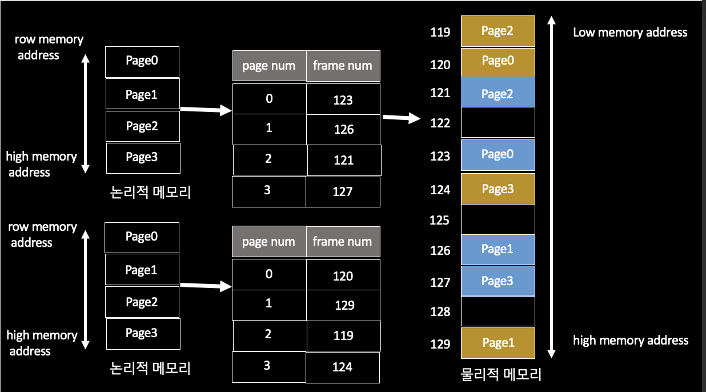
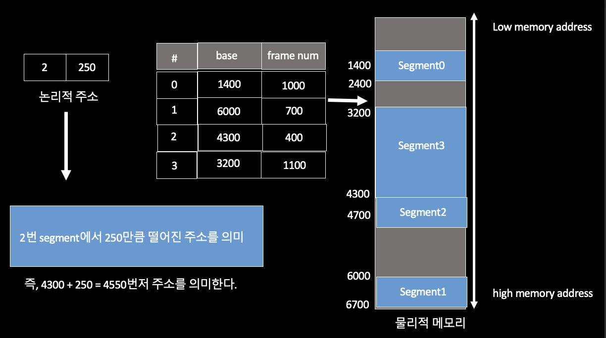

# 페이징이란 무엇인가요?

- 페이징은 운영 체제에서 **외부 단편화 문제**를 해결하는 데 사용된다.
- 이 기술을 사용하면 필요한 데이터를 최대한 빨리 사용할 수 있다.

**핵심 용어**
- **논리적 주소(logical address)**
  - 프로세스가 메모리에 적재되기 위한 독자적인 주소 공간인 논리적 주소가 생성된다.
  - 논리적 주소는 **각 프로세스마다 독립적으로 할당**되며, 0번지부터 시작된다.
- **물리적 주소(physical address)**
  - 프로세스가 실제로 메모리에 적재되는 위치를 말한다.
- **주소 바인딩(address binding)**
  - CPU가 기계어 명령을 수행하기 위해 프로세스의 논리적 주소가 실제 물리적 메모리의 어느 위치에 매핑되는지 확인하는 과정을 말한다.

## Paging

- `paging` 기법은 프로세스의 메모리 공간을 동일한 크기의 `page` 단위로 나누어 물리적 메모리의 서로 다른 위치에 `page`들을 저장하는 메모리 관리 기법이다.
- `paging` 기법에서는 물리적 메모리를 `page`와 같은 크기의 `frame`으로 미리 나누어둔다.
- 또한, 주소 바인딩을 위해 모든 프로세스가 각각의 주소 변환을 위한 `page table`을 갖는다.

- 물리적 메모리 공간이 작은 조각으로 나눠져서 메모리가 충분히 존재함에도 할당이 불가능한 상태를 **메모리 단편화가 발생**했다고 한다.
- `paging` 기법에서는 프로세스의 논리적 주소 공간과 물리적 메모리가 **같은 크기의 `page` 단위**로 나누어지기 때문에 **외부 단편화 문제는 발생하지 않는다.**
- 하지만 프로세스 주소 공간의 크기가 `page` 크기의 배수라는 보장이 없기 때문에, 프로세스의 주소 공간 중 가장 마지막에 위치한 `page` 에서는 **내부 단편화 문제**가 발생할 가능성이 존재한다.
  - **내부 단편화** : 메모리의 크기가 프로세스의 크기보다 큰 경우

## Segmentation

- `segmentation` 기법은 프로세스가 할당받은 메모리 공간을 논리적 의미 단위(`segment`)로 나누어, 연속되지 않는 물리 메모리 공간에 할당될 수 있도록 하는 메모리 관리 기법이다.
- 일반적으로 프로세스의 메모리 영역 중 `Code`, `Data`, `Heap`, `Stack` 등의 기능 단위로 `segment`를 정의하는 경우가 많다.
- `segmentation` 기법에서는 주소 바인딩을 위해 모든 프로세스가 각각의 주소 변환을 위한 `segment table`을 갖는다.

- `segmentation` 기법에서 `segment`의 크기만큼 메모리를 할당하므로 **내부 단편화 문제는 발생하지 않는다.**
- 하지만 서로 다른 크기의 `segment`들이 메모리에 적재되고 제거되는 일이 반복되면, **외부 단편화 문제**가 발생할 가능성이 있다.
  - **외부 단편화** : 남은 메모리의 합이 프로세스의 크기보다 크지만, 연속된 메모리가 아니어서 할당이 불가능한 상태

## Paging과 Segmentation 차이
- `Paging` 기법은 일정한 크기의 단위로 나누어 할당한다.(고정 크기)
- `Segmentation` 기법은 `Code`, `Data`, `Heap`, `Stack` 등의 기능(의미) 단위로 물리 메모리에 할당한다.(가변 크기)

## Paged Segmentation

- `paged segmentation` 기법은 `segmentation` 기법을 기본으로 하되, 이를 다시 동일 크기의 `page`로 나누어 물리 메모리에 할당하는 메모리 관리 기법이다.
- 즉, **프로그램을 의미 단위의 `segment`로 나누고, 개별 `segment`의 크기를 `page`의 배수가 되도록 하는 방법**이다.
- 이를 통해 `segmentation` 기법에서 발생하는 **외부 단편화 문제를 해결**하고, 동시에 `segment` 단위로 프로세스 간의 공유나 접근 권한 보호가 이루어지도록 해서 **`paging` 기법의 단점을 해결**한다.

 

### 참고
- [참고 블로그](https://hyuuny.tistory.com/155)