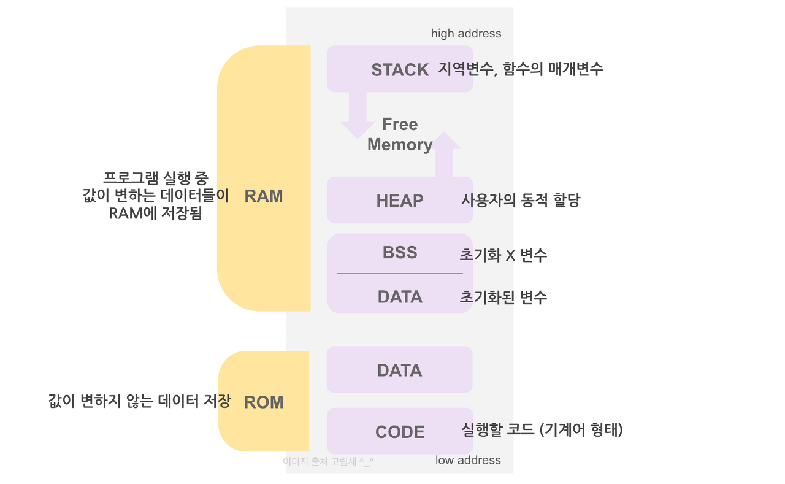
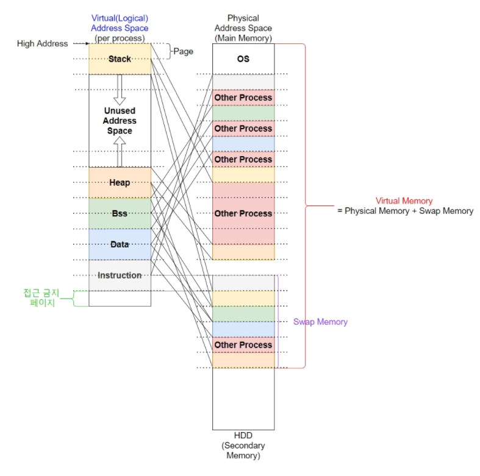

# 가상 메모리란 무엇인가요?

- **가상 메모리(Virtual Memory)** 는 프로세스가 **메모리 외부에서 실행**될 수 있도록 하는 매우 유용한 메모리 관리 기술이다.
- **실제 메모리 크기와 상관없이 메모리를 이용할 수 있도록 가상의 메모리 주소를 사용하는 방법이다.**
- 가상 메모리는 물리 메모리보다 큰 프로세스나 여러 개의 작은 프로세스들을 동시에 실행 시켜, 사용자나 응용 프로그램의 무한대의 메모리가 있다고 느끼도록 하는 것이다.
- 실행 프로그램이 실제 메모리에 맞지 않을 때 특히 사용된다.

**가상 메모리의 주요 기능**
- **메모리 관리의 단순화**
  - 각 프로세스마다 가상 메모리의 통일된 주소 공간을 배정할 수 있으므로 메모리 관리가 단순해진다.
- **메모리 용량 및 안정성 보장**
  - 한정된 공간의 `RAM`이 아닌 거의 무한한 가상 메모리 공간을 배정함으로써 프로세스들끼리 메모리 침범이 일어날 여지를 크게 줄인다.

 

## 가상 주소 공간
- **가상 메모리와 가상(논리) 주소 공간(Virtual Address Space)은 다른 개념이다.**
- **가상 주소 공간은 각 프로세스 당 주어지는 논리적인 공간**이다.
- 가상 주소 공간의 크기는 물리 메모리(`RAM`)의 크기와는 독립적이며, 레지스터 크기에 종속적이다.

### 가상 주소 공간의 구조(프로세스 당)

- **Stack** : 함수 실행 시 저장, 종료 시 반환
- **Unused Address Space** : 필요할 경우(런타임 간 저장, 원할 때 반환)
- **Heap** : 런타임 간 저장, 원할 때 반환
- **Data & BSS** : 컴파일 시 저장, 프로그램 종료 시 반환
- **Instruction(Code or Text)** : 컴파일 시 저장, 프로그램 종료 시 반환

### 가상 주소 공간 관리

- 프로세스의 주소 공간은 **페이지(`page`) 단위로 관리된다.**
- 가상 주소 공간의 주소를 **논리 주소**라고 하는데, 모든 논리 주소가 반드시 물리 메모리의 물리 주소로 할당받는 것은 아니다.
- 가상 주소 공간의 페이지가 물리 주소에 할당되지 않는 경우
  - **필요할 때 물리 주소 할당 받는 경우**
  - **접근 금지 페이지로 남겨둔 경우**
  - **사용되지 않은(`unused`) 논리 주소인 경우**

`Process Life Cycle` 중에 동시에 전체의 `Data`나 `Instruction`이 필요한 것이 아니기 때문에 필요할 때 물리 주소를 할당받고 반환하면 메모리를 효율적으로 사용할 수 있다.

 

### 참고
- [참고 블로그](https://superohinsung.tistory.com/106#%EC%99%9C%20%EA%B0%80%EC%83%81%20%EB%A9%94%EB%AA%A8%EB%A6%AC%EB%A5%BC%20%EC%82%AC%EC%9A%A9%ED%95%98%EB%8A%94%EA%B0%80%3F-1)
- [참고 블로그](https://beeehappy.tistory.com/53)