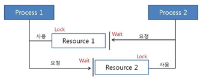

# 교착상태가 무엇인가요?

- **교착상태(DeadLock)** 란, 시스템 자원에 대한 요구가 뒤엉킨 상태이다.
- 즉, 둘 이상의 프로세스가 다른 프로세스가 점유하고 있는 자원을 서로 기다릴 때 무한 대기에 빠지는 상황을 말한다.

- 서로 원하는 자원이 상대방에 할당되어 있어서 두 프로세스는 무한정 `wait` 상태에 빠진다.
- 이런 것을 **DeadLock**이라 한다.

 

# 교착상태가 발생하기 위해서는 어떤 조건이 있어야 하나요?

### 상호 배제(Mutual Exclusion)

- 자원은 한 번에 한 프로세스만 사용할 수 있다.
- 사용 중인 자원을 다른 프로세스가 사용하려면 요청한 자원이 해제될 때까지 기다려야 한다.

### 점유 대기(Hold and Wait)

- 자원을 최소한 하나 보유하고, 다른 프로세스가 할당된 자원을 점유하기 위해 대기하는 프로세스가 존재해야 한다.

### 비선점(No Preemption)

- 다른 프로세스에 할당된 자원은 사용이 끝날 때까지 강제로 빼앗을 수 없다.

### 순환 대기(Circular Wait)

- 대기 프로세스의 집합이 순환 형태로 자원을 대기하고 있어야 한다.

 

# 교착상태의 해결법은 무엇인가요?

- 데드락이 발생하지 않도록 예방(`Prevention`)하기
- 데드락 발생 가능성을 인정하면서도 적절하게 회피(`Avoidance`)하기
- 데드락 발생을 허용하지만 데드락을 탐지(`Detection`)하여, 데드락에서 회복하기

### 예방하기

- 교착상태가 애초에 일어나지 않도록 방지하는 방법으로 교착상태의 발생조건 4가지 중 하나를 부정함으로써 교착상태를 예방한다.
- 자원 낭비가 매우 심하다.
  > - 상호배제 부정 : 여러 프로세스가 공유 자원 사용
  > - 점유대기 부정 : 프로세스 실행 전 모든 자원을 할당
  > - 비선점 부정 : 자원 점유 중인 프로세스가 다른 자원을 요구할 때 가진 자원 반납
  > - 순환대기 부정 : 자원에 고유번호 할당 후 순서대로 자원 요구

### 회피하기

- 교착상태가 발생할 가능성이 있는 자원 할당을 하지 않고 안전한 상태에서만 자원 요청을 허용하는 방법이다.
- 교착상태 회피를 하기 위해서는 다음과 같은 가정이 필요하다.
  - 프로세스 수 고정
  - 자원의 종류와 수 고정
  - 프로세스가 요구하는 최대 자원의 수를 알아야 함
  - 프로세스는 자원 사용 후 반드시 반납
- `Safe state`
  - `safe sequence`(교착상태를 발생시키지 않고 자원을 할당하는 순서)가 존재하며, 모든 프로세스가 정상적으로 종료될 수 있는 상태를 의미한다.
- `Unsafe state`
  - 교착상태가 발생할 가능성이 있는 상태를 의미한다.
    > **교착상태를 회피하기 위한 알고리즘**
    >
    > - 은행원 알고리즘
    >   - 은행이 최소한 한 명에게 대출해줄 수 있는 금액을 항상 보유하고 있어야 한다는 개념에서 나온 이름이다.
    >   - 프로세스가 자원을 요구할 때, 시스템은 자원을 할당한 후에도 안정 상태로 남아있게 되는지 사전에 검사하여 교착 상태를 회피한다.
    >   - 안정 상태면 자원을 할당하고, 아니면 다른 프로세스들이 자원을 해지할 때까지 기다린다.
    >   - [참고](https://velog.io/@minu-j/%EC%9A%B4%EC%98%81%EC%B2%B4%EC%A0%9C-%EB%A7%8C%ED%99%94%EB%A1%9C-%EC%95%8C%EC%95%84%EB%B3%B4%EB%8A%94-%EC%9D%80%ED%96%89%EC%9B%90-%EC%95%8C%EA%B3%A0%EB%A6%AC%EC%A6%98-%EA%B5%90%EC%B0%A9%EC%83%81%ED%83%9C-%ED%9A%8C%ED%94%BC-%EC%95%8C%EA%B3%A0%EB%A6%AC%EC%A6%98)
    > - 자원 할당 그래프 알고리즘
    >   - 교착상태 발견을 위해 프로세스와 자원과의 관계와 할당 상태를 표현하는 그래프
    >   - [참고](https://blog.skby.net/%EC%9E%90%EC%9B%90-%ED%95%A0%EB%8B%B9-%EA%B7%B8%EB%9E%98%ED%94%84-resource-allocation-graph/)

### 탐지하고 회복하기

- 먼저 시스템이 교착상태 예방이나 회피법을 사용하지 않았을 때, 교착상태가 발생할 수 있으니 여기에서 회복하기 위해 교착상태를 탐지하고, 회복하는 알고리즘을 사용한다.
- **탐지**
  - 말 그대로 시스템에 교착상태가 발생했는지에 대한 여부를 탐색하고 회복 기법 알고리즘에 활용하는 것을 의미한다.
  - 탐지 기법은 지속적으로 교착상태를 확인하는 작업이 필요하기 때문에 오버헤드(성능 저하)가 발생하게 된다.
- **회복**
  - 교착상태를 해결하는 기법으로 다음과 같이 나뉜다.
    - **사용자 처리** : 교착상태가 있는 프로세스 중 하나의 프로세스를 사용자가 강제 종료
    - **시스템 처리**
      - 프로세스 중지
        - 교착상태에 속해있는 모든 프로세스를 중지
        - 교착상태가 해결될 때까지 한 프로세스씩 중지
      - 자원 선점
        - 프로세스들로부터 자원을 빼앗아 교착상태가 해결될 때까지 다른 프로세스들에게 자원을 할당
      - 우선순위가 낮은 프로세스나 수행 횟수가 적은 프로세스 위주로 프로세스 자원 선점

 

### 참고

- [참고 블로그](https://velog.io/@seorim0801/%EC%9D%80%ED%96%89%EC%9B%90-%EC%95%8C%EA%B3%A0%EB%A6%AC%EC%A6%98)
- [참고 블로그](https://gyoogle.dev/blog/computer-science/operating-system/DeadLock.html)
