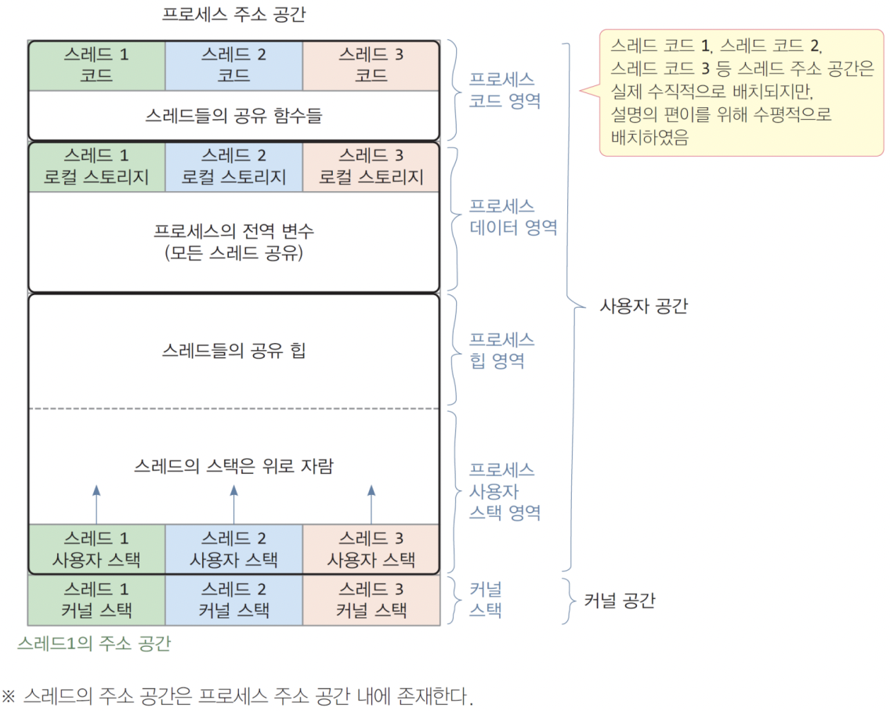
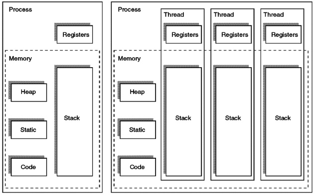

# 쓰레드의 주소공간에 대해서 설명해 주세요.

- 쓰레드의 주소 공간은 크게 **사적 공간**, **공유 공간**, **커널 스택** 세 가지 공간으로 나눌 수 있다.
- **사적 공간**에는 쓰레드 코드 공간, 쓰레드 전용 전역 변수 공간, 스택 공간이 있다.
- **공유 공간**에는 데이터 공간, 힙 공간이 있다.

- 멀티 쓰레드 상황에서 같은 프로세스 내의 모든 쓰레드는 `Code`, `Data`, `Heap` 영역을 공유한다.
- `Stack` 영역은 공유하지 않고 쓰레드별로 할당받는다.
- **자원을 공유하기 때문에 동기화 문제가 발생할 수 있다.**

> **꼬리 질문**
> - **`Stack`과 `Heap` 공간에 대해, 접근 속도가 더 빠른 공간은 어디일까요?**
>   - **할당 및 해제 속도는 `Stack`이 훨씬 빠르다.**
>   - 스택은 **이미 할당 되어 있는 공간**을 사용하는 것이고, 힙은 따로 할당해서 사용하는 공간이다(동적으로).
>   - 하지만 스택은 공간이 매우 적기 때문에 모든 응용에서 스택을 사용할 수는 없다는 단점이 있다.
>   - **스택에서 할당의 의미**는 이미 생성되어 있는 스택에 대해 포인터의 위치만 바꿔주는 단순한 CPU 연산이다.
>   - 반면 힙에서의 할당은 요청된 `chunk`의 크기, 현재 메모리의 `fragmentation` 상황 등 다양한 요소를 고려하기 때문에 더 많은 CPU 연산이 필요하다.