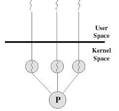
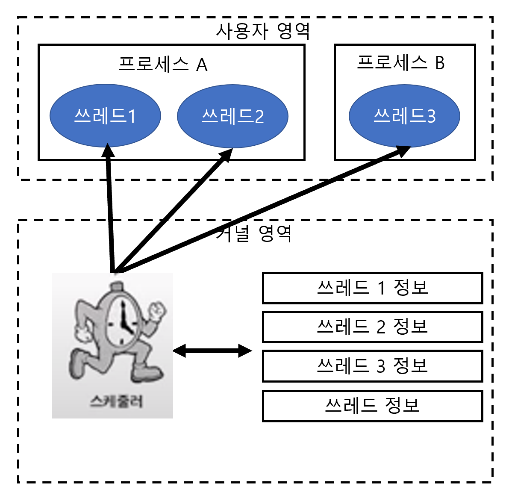
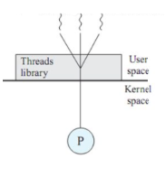
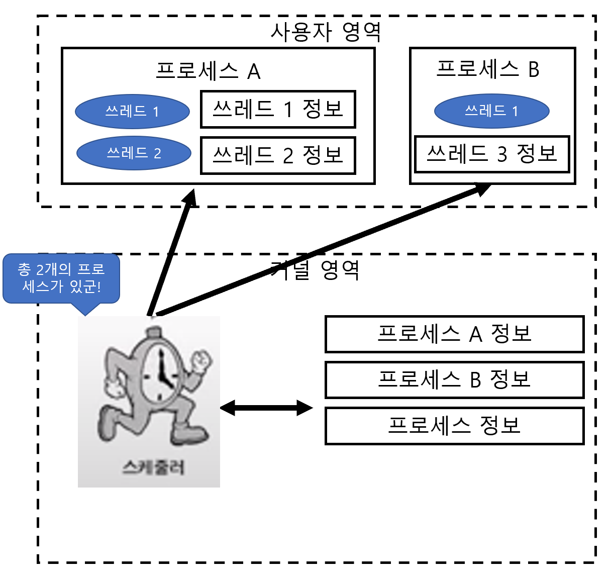

# 커널 수준 쓰레드와 사용자 수준 쓰레드의 차이는 무엇인가요?

## 커널 수준 쓰레드

- 네이티브 쓰레드, OS 쓰레드, OS레벨 쓰레드 라고도 한다.
- [커널](https://github.com/genesis12345678/TIL/blob/main/interview/os/11_20/Kernel.md) 레벨에서 생성되는 쓰레드로, 운영체제 시스템 내에서 생성되어 동작하고 커널이 직접 관리하는 쓰레드이다.

 

- 스케줄러가 쓰레드들을 직접 관리한다.

### 커널 수준 쓰레드 장점

- 프로세스의 쓰레드들을 몇몇 프로세서에 한꺼번에 디스패치 할 수 있기 때문에 멀티 프로세서 환경에서 매우 빠르게 동작한다.
- 다른 쓰레드가 입출력 작업이 다 끝날 때까지 다른 쓰레드를 사용해 다른 작업을 진행할 수 있다.
- 커널이 각 쓰레드를 개별적으로 관리할 수 있다.
- 커널이 직접 쓰레드를 제공해 주기 때문에 안전성과 다양한 기능이 제공된다.

### 커널 수준 쓰레드 단점

- 스케줄링 동기화를 위해 커널을 호출하는데 무겁고 오래 걸린다.(저장한 내용을 다시 불러오는 과정이 필요하다.)
- 사용자 모드에서 커널 모드로의 전환이 빈번하게 이뤄져 성능 저하가 발생한다.
- 사용자가 프로그래밍할 때 구현하기 어렵고, 자원을 더 많이 소비하는 경향이 있다.

 

## 사용자 수준 쓰레드

- 쓰레드 개념을 프로그래밍 레벨에서 추상화한 것이다.
- 사용자 단에서 생성 및 관리되는 쓰레드로, 커널이 따로 관리하지 않고 커널이 이 쓰레드에 대해서 알지도 못한다.
- 유저 쓰레드가 CPU에서 실행되려면 커널 쓰레드와 반드시 연결돼야 한다.

- 스케줄러가 쓰레드를 직접 관리하지 않는다.
- 스케줄러는 사용자 수준 쓰레드를 알 수 없고, 단순히 사용자 영역에서 작성한 코드로 인해 쓰레드가 실행되는 것이다.

### 사용자 수준 쓰레드 장점

- 운영체제에서 쓰레드를 지원할 필요가 없다.
- 스케줄링 결정이나 동기화를 위해 커널을 호출하지 않았기 때문에 인터럽트가 발생할 때 커널 수준 쓰레드보다 오버헤드가 적다.
- 사용자 영역 쓰레드에서 행동을 하기 때문에 OS 스케줄러의 `Context Switch`가 없다.(사용자 수준 쓰레드 스케줄러를 이용)
- 커널은 쓰레드의 존재조차 모르기 때문에 모드 간의 전환이 없고, 성능 이득이 발생한다.

### 사용자 수준 쓰레드 단점

- 시스템 전반에 걸친 스케줄링 우선순위를 지원하지 않는다.
  - 무슨 쓰레드가 먼저 동작할 지 모른다.
- 프로세스에 속한 쓰레드 중 `I/O` 작업 등에 의해 하나롣 블록이 걸린다면 전체 쓰레드가 블록된다.

 

### 참고
- [참고 블로그](https://velog.io/@chanyoung1998/%EC%8A%A4%EB%A0%88%EB%93%9C%EC%9D%98-%EC%A2%85%EB%A5%98%ED%95%98%EB%93%9C%EC%9B%A8%EC%96%B4-%EC%8A%A4%EB%A0%88%EB%93%9C-OS-%EC%8A%A4%EB%A0%88%EB%93%9C-%EC%9C%A0%EC%A0%80-%EB%A0%88%EB%B2%A8-%EC%8A%A4%EB%A0%88%EB%93%9C)