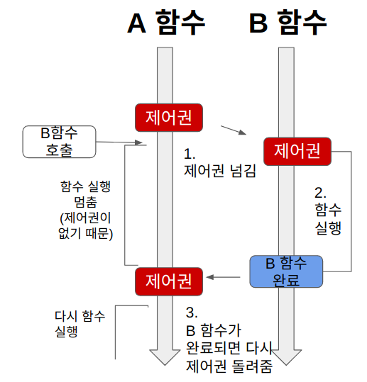
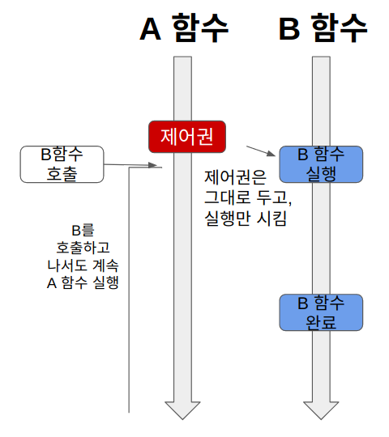
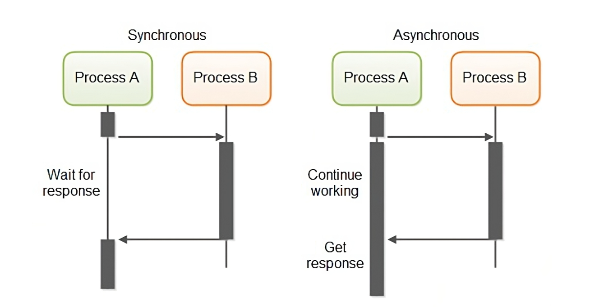
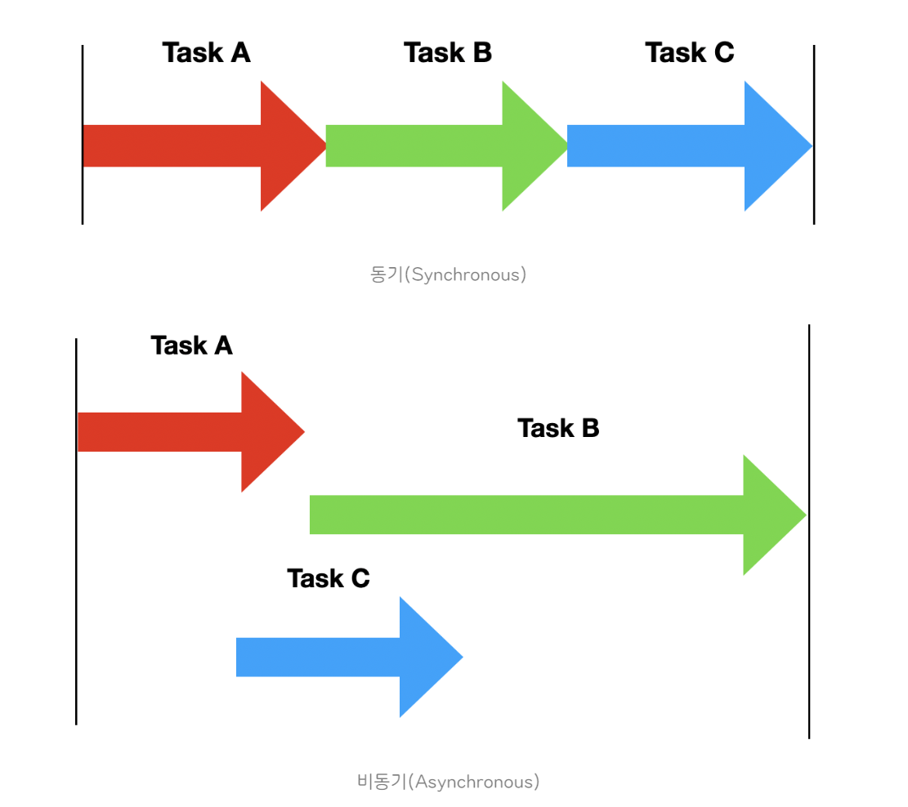
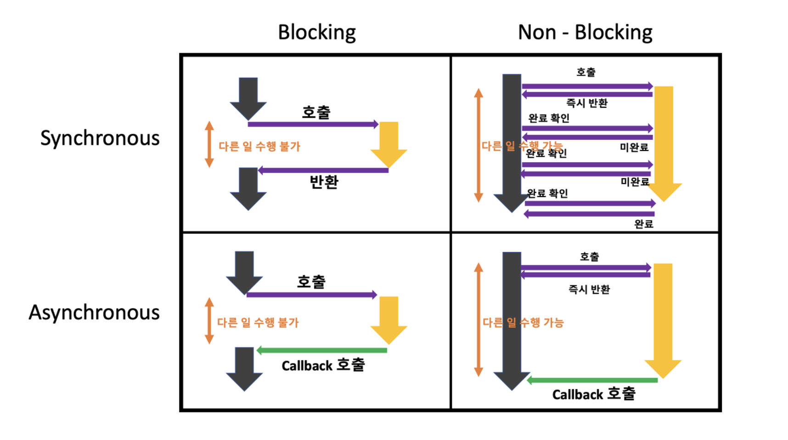
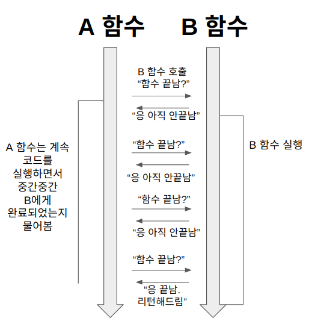
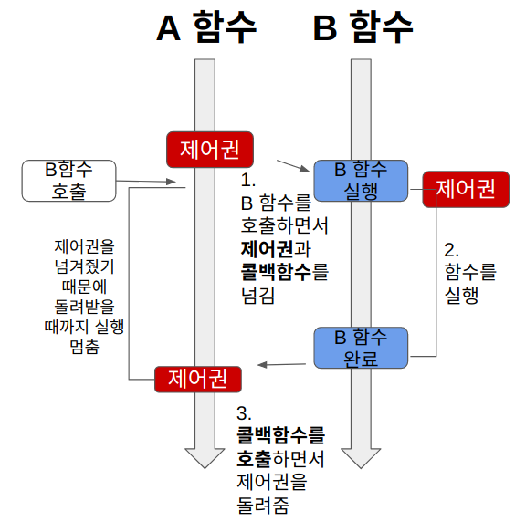
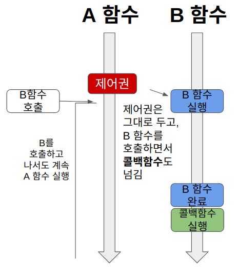

# 블로킹과 논블로킹의 차이는 무엇인가요?

### 중요 용어

- **제어권**
  - 제어권은 자신의 코드(함수)를 실행할 권리 같은 것으로, 제어권을 가진 함수는 자신의 코드를 끝까지 실행한 후, 자신을 호출한 함수에게 돌려준다.
- **결과값을 기다린다.**
  - A 함수에서 B 함수를 호출했을 때, A 함수가 B 함수의 결괏값을 기다리느냐의 여부를 의미한다.

## 블로킹(Blocking)

- **블로킹**은 A 함수가 B 함수를 호출하면, **제어권을 A가 호출한 B 함수에 넘겨주는 방식이다.**



1. A 함수가 B 함수를 호출하면 B에게 제어권을 넘긴다.
2. 제어권을 넘겨받은 B는 함수를 실행한다. A는 B에게 제어권을 넘겼기 때문에 함수 실행을 잠시 멈춘다.(`Block`)
3. B 함수는 실행이 끝나면 자신을 호출한 A 함수에게 제어권을 돌려준다.
4. 제어권을 다시 받은 A 함수는 그 다음 작업을 실행한다.

## 논블로킹(Non-Blocking)

- **논블로킹**은 A 함수가 B 함수를 호출해도 **제어권은 그대로 자신이 가지고 있는 방식이다.**



1. A 함수가 B 함수를 호출하면, B 함수는 실행되지만, 제어권은 A 함수가 그대로 가지고 있는다.
2. A 함수는 계속 제어권을 가지고 있기 때문에 B 함수를 호출한 이후에도 자신의 코드를 계속 실행한다.

<br>

# 동기와 비동기의 차이는 무엇인가요?

### 중요 용어

- **제어권**
  - 제어권은 자신의 코드(함수)를 실행할 권리 같은 것으로, 제어권을 가진 함수는 자신의 코드를 끝까지 실행한 후, 자신을 호출한 함수에게 돌려준다.
- **결과값을 기다린다.**
  - A 함수에서 B 함수를 호출했을 때, A 함수가 B 함수의 결괏값을 기다리느냐의 여부를 의미한다.

## 동기(Synchronous)

- **요청을 보내고 실행이 끝나면 다음 동작을 처리하는 방식**
  - 즉, **요청한 작업에 대해 완료 여부를 따져** 순차대로 처리하는 것을 말한다.
  - 순서에 맞추어 진행되기 때문에 제어하기 쉽다.
  - 여러가지 요청을 동시에 처리할 수 없어 효율이 떨어진다.
  - 예) 콜센터 : 콜센터는 한 손님의 전화 응대가 끝난 후에 다음 손님의 응대를 진행할 수 있다.

## 비동기(Asynchronous)

- **요청을 보내고 해당 동작의 처리 여부와 상관없이 다음 요청이 동작하는 방식**
  - 동기와 반대로 **요청한 작업에 대해 완료 여부를 따지지 않기 때문에** 자신의 다음 작업을 그대로 수행하게 된다.
  - 작업이 완료되는 시간을 기다릴 필요가 없기 때문에 자원을 효율적으로 사용할 수 있다.
  - 작업이 완료된 결과를 제어하기 어렵다.
  - 예) 이메일 : 우리는 이메일을 보내고 답변을 받지 않고도 이메일을 다시 보낼 수 있다.


동기(`Synchronous`)는 Process B가 완료되어야 다음 작업을 수행하고, 비동기(`Asynchronous`)는 Process B의 완료 여부를 따지지 않고 바로 다음 작업을 수행한다.

### 비동기의 성능 이점

- 비동기는 요청한 작업에 대하여 완료 여부를 신경쓰지 않고 자신의 그다음 작업을 수행한다.
- 이것은 `I/O` 작업과 같은 느린 작업이 발생할 때, 기다리지 않고 다른 작업을 처리하면서 동시에 처리하며 멀티 작업을 진행할 수 있다는 것을 뜻한다.
- 즉, 비동기는 전반적인 시스템 성능 향상에 도움을 줄 수 있다.


### 동기와 비동기는 작업 순서 처리 차이

- 동기와 비동기의 차이를 쉽게 말하면 여러 개의 요청 작업을 순차적으로 처리하느냐 아니냐에 따른 차이다.
- **동기 작업은 요청한 작업에 대해 순서가 지켜지는 것이고, 비동기 작업은 순서가 지켜지지 않을 수 있다는 것이다.**



- A, B, C라는 3개의 작업을 각각의 방식으로 수행했을 때의 그림이다.
- 동기는 순서대로 실행되고, 비동기는 무작위 순서로 실행된다.

<br>

# 동기와 비동기, 블로킹과 논블로킹을 엮어서 설명해 주세요.

- 각각을 혼합해서 총 네 가지 경우의 수로 활용할 수 있다.



1. 동기-블로킹(Sync Blocking)
2. 동기-논블로킹(Sync Non-Blocking)
3. 비동기-블로킹(Async Blocking)
4. 비동기-논블로킹(Async Non-Blocking)

## 동기-블로킹(Sync Blocking)

- `Sync Blocking` 조합은 다른 작업이 진행되는 동안 자신의 작업을 처리하지 않고(`Blocking`), 다른 작업의 완료 여부를 받아 순차적으로 처리하는 (`Sync`) 방식이다.
- **다른 작업의 결과가 자신의 작업에 영향을 주는 경우에 활용할 수 있다.**


- 동기-블로킹 방식은 작업량이 많거나 시간이 오래 걸리는 작업을 처리해야 하는 경우에는 좋지 않다.
- 왜냐하면 작업을 처리하기 시작하면 작업이 끝날 때까지 다른 작업을 처리하지 못하므로, 전체 처리 시간이 오래 걸리게 되어 비효율적이게 된다.
- 이 경우 비동기-논블로킹 방식으로 작업을 처리하는 것이 좋다.

## 동기-논블로킹(Sync Non-Blocking)

- `Sync Non-Blocking` 조합은 다른 작업이 진행되는 동안에도 자신의 작업을 처리하고(`Non-Blocking`), 다른 작업의 결과를 바로 처리하여 작업을 순차대로 수행 하는(`Sync`) 방식이다.



- A 함수는 B 함수의 리턴값이 필요하기 때문에 중간중간 B 함수에게 함수 실행을 완료했는지 물어본다.
- 즉, 논블로킹인 동시에 동기인 것이다.

```java
// Runnable 인터페이스를 구현하는 클래스 정의
class MyTask implements Runnable {
    @Override
    public void run() {
        // 비동기로 실행할 작업
        System.out.println("Hello from a thread!");
    }
}

public class Main {
    public static void main(String[] args) {
        // Thread 객체 생성
        Thread thread = new Thread(new MyTask());

        // 스레드 실행
        thread.start();

        // Non-Blocking이므로 다른 작업 계속 가능
        System.out.println("Main thread is running...");

        // Sync를 위해 스레드의 작업 완료 여부 확인
        while (thread.isAlive()) {
            System.out.println("Waiting for the thread to finish...");
        }
        System.out.println("Thread finished!");

        System.out.println("Run the next tasks");
    }
}
```

```text
Main thread is running...
Waiting for the thread to finish...
Waiting for the thread to finish...
Waiting for the thread to finish...
Waiting for the thread to finish...
...(생략)
Hello from a thread!
Waiting for the thread to finish...
Thread finished!
Run the next tasks
```

## 비동기-블로킹(Async Blocking)

- `Async Blocking` 조합은 다른 작업이 진행되는 동안 자신의 작업을 멈추고 기다리는(`Blocking`), 다른 작업의 결과를 바로 처리하지 않아 순서대로 작업을 수행하지 않는 (`Async`) 방식이다.
- 비동기-블로킹의 경우 동기-블로킹과 비교해서 성능 차이가 거의 없기 때문에 실무에서 다룰 일은 거의 없다.



- A 함수는 B 함수의 리턴 값에 신경쓰지 않고, 콜백 함수를 보낸다.(비동기)
- 그런데 B 함수의 작업에 관심없음에도 불구하고, A 함수는 B 함수에게 제어권을 넘긴다.(블로킹)
- 따라서 A 함수는 자신과 관련 없는 B 함수의 작업이 끝날 때까지 기다려야 한다.

## 비동기-논블로킹(Async Non-Blocking)

- `Async Non-Blocking` 조합은 다른 작업이 진행되는 동안에도 자신의 작업을 처리하고(`Non-Blocking`), 다른 작업의 결과를 바로 처리하지 않아 작업 순서가 지켜지지 않는 (`Async`) 방식이다.
- **다른 작업의 결과가 자신의 작업에 영향을 주지 않는 경우에 활용할 수 있다.**



- A 함수는 B 함수를 호출한다.
- 이 때 제어권을 B 함수에 주지 않고, 자신이 계속 가지고 있는다.(논블로킹)
- 따라서 B 함수를 호출한 이후에도 멈추지 않고 자신의 코드를 계속 실행한다. 그리고 B 함수를 호출할 때 콜백 함수를 함께 준다.
- B 함수는 자신의 작업이 끝나면 A 함수가 준 콜백 함수를 실행한다.(비동기)

**`Async Non-Blocking` 조합은 작업량이 많거나 시간이 오래 걸리는 작업을 처리해야 하는 경우에 적합하다.**
대용량 데이터를 처리하거나 많은 요청을 처리하는 서비스에서는 **비동기 논블로킹** 방식을 사용하여 한 작업이 처리되는 동안 다른 작업을 처리할 수 있으므로 전체 처리 시간을 줄일 수 있어 애플리케이션 처리 성능을 향상 시킬 수 있게 된다.

<br>

<br>

### 참고
- [참고 블로그](https://inpa.tistory.com/entry/%F0%9F%91%A9%E2%80%8D%F0%9F%92%BB-%EB%8F%99%EA%B8%B0%EB%B9%84%EB%8F%99%EA%B8%B0-%EB%B8%94%EB%A1%9C%ED%82%B9%EB%85%BC%EB%B8%94%EB%A1%9C%ED%82%B9-%EA%B0%9C%EB%85%90-%EC%A0%95%EB%A6%AC#%EB%8F%99%EA%B8%B0/%EB%B9%84%EB%8F%99%EA%B8%B0_+_%EB%B8%94%EB%A1%9C%ED%82%B9/%EB%85%BC%EB%B8%94%EB%A1%9C%ED%82%B9_%EC%A1%B0%ED%95%A9)
- [참고 블로그](https://velog.io/@nittre/%EB%B8%94%EB%A1%9C%ED%82%B9-Vs.-%EB%85%BC%EB%B8%94%EB%A1%9C%ED%82%B9-%EB%8F%99%EA%B8%B0-Vs.-%EB%B9%84%EB%8F%99%EA%B8%B0)
