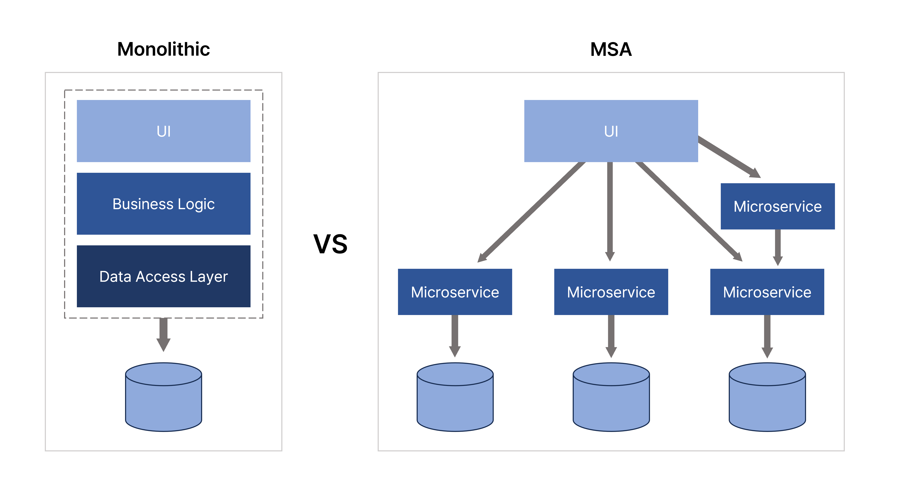

# MSA에 대해 설명해 주세요.

- **MSA**가 등장하기 전에는 `모놀리틱 시스템`을 사용했는데, 모놀리틱 시스템이란 소프트웨어 애플리케이션을 하나의 단일한 독립 시스템으로 구축하는 소프트웨어 
    아키텍처 스타일을 말한다.
- 즉, 하나의 애플리케이션에 모든 비즈니스 로직을 통째로 모아놓은 구조이다.
- 모놀리틱 시스템은 소규모 프로젝트에 적합하고, 개발/빌드/배포/테스트가 용이하며 인프라 구조가 단순하여 운영 비용 부담이 없다는 장점이 있었다.
- **하지만 시스템 규모가 점점 커지고 복잡해지면서 모놀리틱 시스템의 단점이 부각되기 시작했다.**
- 작은 수정사항에도 전체 빌드 및 배포가 이뤄져야 해서 시간이 오래 걸리고, 많은 양의 코드가 몰려 있어 유지보수가 어려웠다.
- 일부 오류가 전체에 영향을 미치는 점, 스케일 아웃 설정이 복잡한 점 역시 문제가 되었다.

**MSA는 이러한 모놀리틱 시스템의 대안으로 등장하였다.**
- MSA는 소프트웨어 시스템을 여러 작은 독립적인 서비스로 분리하여 개발하고 배포하는 방식이다.
- 하나의 애플리케이션을 구분 가능한 여러 개의 작은 서비스로 나눠 사용자의 요청을 처리하는 구조이다.

**MSA 장단점**
- **장점**
  - 각 서비스별 코드 수정이 쉽고, 수정한 서비스만 배포 가능하며, 배포 시 전체 서비스 중단이 없다.
  - 일부 서비스에 장애가 발생하여도 전체 서비스에 장애로 확장될 가능성이 적다.
  - 각각의 서비스들은 서로 다른 언어와 프레임워크로 구성될 수 있다.
  - 스케일 아웃이 필요한 경우에는 해당 서비스만 추가하여 리소스의 효율적 사용이 가능하기 때문에 서비스의 확장이 용이하다.
- **단점**
  - 서비스가 분리되어 있어, 테스팅이나 트랜잭션 처리 등이 어렵다.
  - 서비스 간에 API로 통신하기 때문에 그에 대한 비용이 발생한다.
  - 서비스 간의 호출이 연속적이기 때문에 디버깅 및 에러 트레이싱이 어렵다.

 

 

### 참고
- [참고 사이트](https://metanetglobal.com/bbs/board.php?bo_table=tech&wr_id=38)