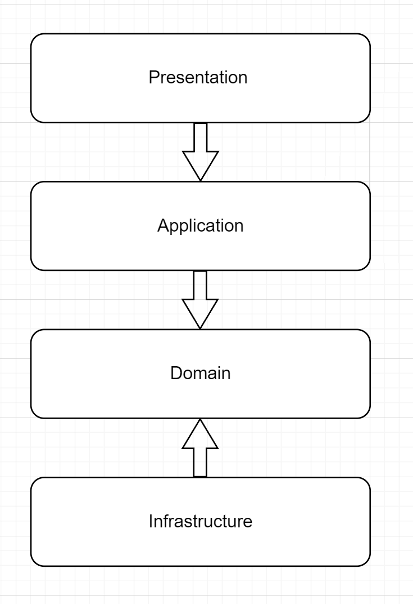

# 레이어드 아키텍처에 대해 설명해 주세요.

- **레이어드 아키텍처**는 애플리케이션을 계층별로 나눠 각 계층에 적절한 책임과 역할을 부여해 계층별 재사용성을 높이는 설계 방법이다.
- **각 구성 요소들이 관심사를 분리함으로써 계층의 응집도는 높이고, 결합도는 낮추어 이를 통해 재사용성과 유지보수성을 높일 수 있다.**
- 과거에는 `Controller - Service - DAO` 형태의 3-티어 아키텍처가 유행했고, 현재는 **표현, 응용, 도메인, 인프라스트럭처**로 나눈 4-티어 아키텍처가 널리 사용되고 있다.

## 도메인 주도 설계 레이어드 아키텍처

- **표현(`Presentation`) 계층** : 
  - `Interface` 계층이라고도 부르는 계층으로, 클라이언트로부터 들어오는 요청을 받고, 응답해 주는 역할을 한다.
  - 컨트롤러가 전형적인 표현 계층에 속한다.
  - 표현 계층으로 들어온 데이터는 값, 타입 등 간단한 유효성 검사를 한 뒤 응용 계층으로 처리를 넘긴다.
- **응용(`Application`) 계층**
  - 표현 계층에서 넘겨 받은 데이터로 새로운 자원을 저장하거나 저장되어 있던 자원을 조회해 온다.
  - 여기서 자원은 도메인 객체를 말하며, 조회된 도메인 객체의 메서드를 실행시킨다.
  - 주로 서비스라고 불리는 코드가 위치한다.
- **도메인(`Domain`) 계층**
  - 도메인의 핵심적인 지식이 있는 계층으로, 도메인 객체가 위치한다.
  - 도메인의 핵심적인 지식이란 상품 이름, 가격, 재고 수량 등 비즈니스와 관련된 요구사항이라고 볼 수 있다.
  - **도메인 계층은 다른 계층이나 외부 요소에 의존하지 않도록 만드는 것이 좋다.**
- **인프라스트럭처(`Infrastructure`) 계층**
  - 특정 인프라스트럭처에 접근하는 구현 코드들이 위치하는 계층이다.
  - 데이터베이스에 상품을 저장하는 코드 등이 포함되어야 한다.

**도메인 주도 설계 레이어드 아키텍처에서 반드시 지켜야 하는 의존성 방향**
- 도메인 계층은 다른 계층에 의존하지 않아야 한다.
- 다른 모든 계층은 인프라스트럭처 계층에 의존하지 않아야 한다.

> - **일반적인 레이어드 아키텍처 규칙**
>   - 상위 계층이 하위 계층을 호출하는 **단방향성**을 유지한다.
>   - 상위 계층은 하위 계층을 모두 알 필요없이 **바로 밑의 근접 계층**만 활용한다.
>   - 상위 계층이 하위 계층의 영향을 받지 않게 구성해야 한다.
>   - 하위 계층은 자신을 사용하는 상위 계층을 알지 못하게 구성해야 한다.
>   - 계**층 간의 호출은 인터페이스를 사용한다.**(느슨한 결합 유지)
> 
> **도메인 주도 설계에서 도메인 계층 입장에서 이런 식으로 구현을 하게 되면 인프라스트럭처 계층의 변화에 따라서 도메인 계층이 영향을 받게 된다.** 
> 그래서 [DIP](https://github.com/genesis12345678/TIL/blob/main/Java/OOP/solid/solid.md#dip---%EC%9D%98%EC%A1%B4%EA%B4%80%EA%B3%84-%EC%97%AD%EC%A0%84-%EC%9B%90%EC%B9%99)를 이용하여 도메인 계층에서 정의한 인터페이스를 인프라스트럭처에서 구현 하는 식으로 설계한다.
> 
> **이런 구조는 도메인 모델의 구현체에 최소한의 영향을 주면서 확장 및 유지보수에 유리하다.**

 

### 참고
- [참고 블로그](https://devlos.tistory.com/50)