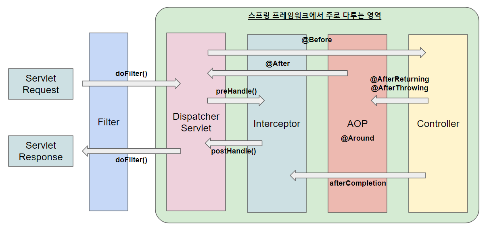

# 필터와 인터셉터의 차이는 무엇인가요?

- **Filter**와 **Interceptor**는 여러 로직에서 공통으로 관심이 있는 **공통 관심사**를 해결하는데 도움을 주는 기능들이다.



## 필터(Filter)

- **자바 표준 스펙**으로, **디스패처 서블릿(`DispatcherServlet`)에 요청이 전달되기 전, 후에  부가적인 작업을 처리할 수 있는 객체다.**
- 필터는 스프링 컨테이너 밖에 존재하여 톰캣과 같은 서블릿 컨테이너(웹 컨테이너)에 의해 관리가 된다.

**필터를 추가하려면 `Filter` 인터페이스를 구현해야 한다.**
```java
public interface Filter {
    default void init(FilterConfig filterConfig) throws ServletException {
    }

    void doFilter(ServletRequest request, ServletResponse response, FilterChain chain)
            throws IOException, ServletException;
    
    default void destroy() {
    }
}
```
- `init()` : 필터 초기화 메서드로, 서블릿 컨테이너가 생성될 때 호출된다.
- `doFilter()` : URL 패턴에 맞는 모든 HTTP 요청이 디스패처 서블릿으로 전달되기 전에 웹 컨테이너에 의해 실행된다.
  - 필요한 로직을 구현하면 되며, 파라미터로 넘어오는 `FilterChain`의 `doFilter()`를 꼭 호출해야 다음 대상으로 요청을 전달하게 된다.
- `destroy()` : 필터 종료 메서드로, 서블릿 컨테이너가 종료될 때 호출된다.

## 인터셉터(Interceptor)

- **스프링이 제공하는 기술**로, **디스패처 서블릿이 컨트롤러를 호출하기 전, 후 요청에 대해 부가적인 작업을 처리하는 객체다.**
- 웹 컨테이너에서 동작하는 필터와 달리, 인터셉터는 스프링 컨테이너에서 동작한다.
  - **그래서 서블릿 필터, 스프링 인터셉터 라고 불린다.**

**인터셉터를 추가하려면 `HandlerInterceptor` 인터페이스를 구현해야 한다.**
```java
public interface HandlerInterceptor {
	default boolean preHandle(HttpServletRequest request, HttpServletResponse response, Object handler) throws Exception {
        return true;
	}

	default void postHandle(HttpServletRequest request, HttpServletResponse response, Object handler,
			@Nullable ModelAndView modelAndView) throws Exception {
	}

	default void afterCompletion(HttpServletRequest request, HttpServletResponse response, Object handler,
			@Nullable Exception ex) throws Exception {
	}

}
```
- `preHandle()` : 컨트롤러가 호출되기 전에 실행된다. `true`를 반환해야 다음 단계로 진행이 된다.
- `postHandle()` : 컨트롤러가 호출된 후에 실행된다. 컨트롤러에서 예외가 발생하면 호출되지 않는다.
- `afterCompletion()` : 뷰까지 렌더링 되고, 모든 응답이 완료된 후에 호출된다.
  - 컨트롤러에서 예외가 발생해도 반드시 호출된다.(파라미터로 예외 정보가 넘어온다.)
  - 사용한 리소스를 반환할 때 쓰면 좋다.

**인터셉터 대신에 컨트롤러에 부가기능을 어드바이스로 만들어 AOP를 적용하면 안될까?**
- 다음과 같은 단점들이 있다.
  - 컨트롤러는 타입과 실행 메서드가 모두 제각각이라 포인트컷의 작성이 어렵다.
  - 컨트롤러는 파라미터나 리턴 값이 일정하지 않다.
  - AOP에서는 `HttpServletReqeust`, `HttpServletResponse` 객체를 얻기 어렵지만, 인터셉터는 파라미터로 넘어온다.

<br>

## 필터와 인터셉터 차이

### [기술]

- **필터** : 자바 표준 기술
- **인터셉터** : 스프링이 제공하는 기술

### [관리되는 컨테이너]

- **필터** : 서블릿 컨테이너가 관리
- **인터셉터** : 스프링 컨테이너가 관리

### [다음 필터/인터셉터 실행]

- **필터** : 다음 필터를 실행하기 위해 명시적으로 코드를 작성해야 한다.
- **인터셉터** : 다음 인터셉터를 실행하기 위해 신경 써야 하는 부분이 없다.

### [객체 조작 가능 여부]

- **필터** : `Requset`, `Response` 를 필터 체이닝 중간에 새로운 객체로 바꿀 수 있다.(조작이 가능하다.)
- **인터셉터** : `Request`, `Response`를 인터셉터 체이닝 중간에 새로운 객체로 바꿀 수 없다.

### [예외 처리]

- **필터** : 예외가 발생하면 `@~Advice`에서 처리하지 못한다.
- **인터셉터** : 예외가 발생하면 `@~Advice`에서 처리가 가능하다.

### [주 사용 기능]

- **필터**
  - 이미지/데이터 압축 및 문자열 인코딩
  - 모든 요청에 대한 로깅
  - 공통 보안 및 인증/인가

> 필터는 자바 표준 기술이므로 **스프링과 무관하게 전역적으로 처리해야 하는 작업들을 처리할 수 있다.**<br>
> 대표적으로 보안 공통 작업이 있는데, 필터는 서블릿 이전에 동작하므로 전역적으로 해야하는 보안 검사를 하여 올바른 요청이 아닐 경우 차단할 수 있다. 
> 그러면 스프링 컨테이너까지 요청이 전달되지 못하므로 안전성을 높일 수 있다.

- **인터셉터**
  - API 호출 시간 로깅
  - 세션 및 쿠키 체크
  - 세부적인 보안 및 인증

> 인터셉터는 **클라이언트 요청과 관련되어 전역적으로 처리해야 하는 작업들을 처리할 수 있다.**<br>
> 인터셉터는 필터와는 다르게 `HttpServletRequest`, `HttpServletResponse` 객체를 조작할 수는 없지만, 내부적으로 갖는 값은 조작할 수 있다. 그러므로 
> **컨트롤러로 넘겨주기 위한 정보를 가공하기에 용이하다.** 예를 들어 사용자의 ID를 기반으로 조회한 사용자 정보를 `HttpServletRequest`에 넣어줄 수 있다.

<br>

### 참고
- [참고 블로그](https://mangkyu.tistory.com/173)
- [참고 블로그](https://jake-seo-dev.tistory.com/83)
- [참고 동영상](https://www.youtube.com/watch?v=v86B35pwk6s)