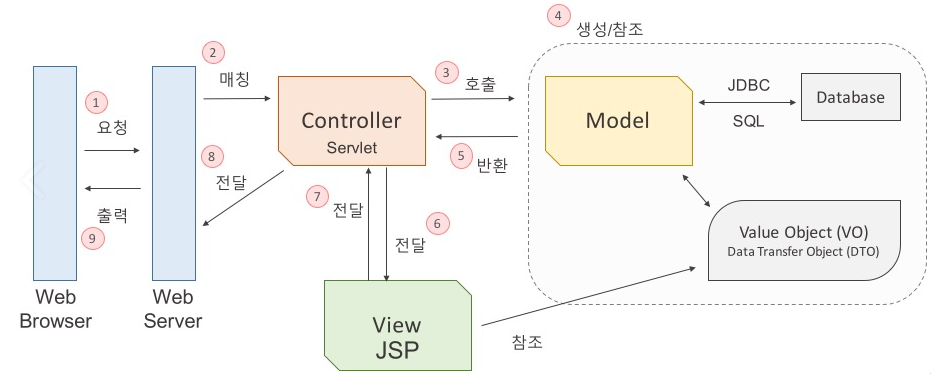
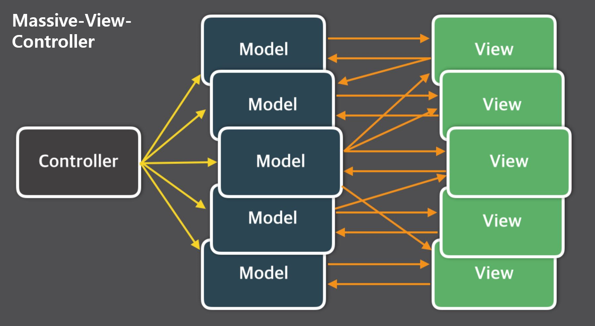

# MVC 패턴에 대해 설명해 주세요.

- _**MVC 패턴** : Model-View-Controller 패턴_
- 과거 MVC 패턴이 없던 시절에는 JSP를 사용하여 화면에 동적인 결과를 출력했다.
- 하지만 화면을 출력하기 위한 코드와 화면에 필요한 데이터를 가져오는 코드가 한 파일에 함께 존재해 유지보수가 매우 힘들었다.
- 이러한 문제를 해결하기 위해 나타난 것이 **MVC 패턴**이다.
- **MVC 패턴**도 하나의 디자인 패턴이며, **애플리케이션을 3가지 역할로 구분한 개발방법론**이다.

- **Model** : 데이터와 관련된 부분
- **View** : 사용자한테 보여지는 부분, `Model`의 데이터를 사용한다.
- **Controller** : 클라이언트의 요청을 받고, `Model`과 `View`를 이어주는 중개자 역할

**이렇게 각 역할을 명확하게 구분함으로써 유지보수와 확장성에 유연하게 대처할 수 있다.**

**MVC를 지키면서 코딩하는 방법**
1. **`Model`은 `Controller`와 `View`에 의존하지 않아야 한다.**
   - `Model` 내부에 `Controller`와 `View`에 관련된 코드가 있으면 안 된다.
2. **`View`는 `Model`에만 의존해야 하고, `Controller`에는 의존하면 안 된다.**
   - `View` 내부에는 `Model`의 코드만 있을 수 있고, `Controller`의 코드가 있으면 안 된다.
3. **`View`가 `Model`로부터 데이터를 받을 때는, 사용자마다 다르게 보여주어야 하는 데이터에 대해서만 받아야 한다.**
   - `View`는 UI(레이아웃)와 `Model`로부터 받은 데이터가 합쳐져 만들어진 화면이다.
   - UI는 모든 사용자에게 공통으로 보여주는 화면이므로 `View`가 자체적으로 가지고 있고, 사용자 정보와 같은 사용자마다 다르게 보여줘야 하는 데이터만 `Model`로부터 받아야 한다.
4. **`Controller`는 `Model`과 `View`에 의존해도 된다.**
   - `Controller`의 핵심 역할은 모델 객체로의 데이터 흐름을 제어하여 **`View`와 `Model`의 역할을 분리하는 것에 있다.**
   - 때문에 `Controller` 내부에는 `Model`과 `View`의 코드가 있을 수 있다.
5. **`View`가 `Model`로부터 데이터를 받을 때, 반드시 `Controller`를 통해서 받아야 한다.**
   - `Model`로부터 직접 받으면 1번 규칙을 어기게 된다.

## MVC 패턴 장점
- 기능별로 코드를 분리하여 가독성과 코드의 재사용성 증가
- 각 구성요소들을 독립시켜 분업을 가능하게 해주기 때문에 개발의 효율성을 높여준다.
- 개발 후에도 유지보수성과 확장성이 보장된다.

## MVC패턴 한계
- `Model`과 `View`는 서로의 정보를 갖지 않는 독립적인 상태이지만, `Controller`라는 중간 매개체를 통해 연결이 이루어지기 때문에 의존성이 완전히 분리되었다고 할 수는 없다.
- 복잡한 대규모 프로그램의 경우 많은 `View`와 `Model`이 `Controller`를 통해 연결되기 때문에 컨트롤러가 불필요하게 커지는 현상이 발생하는데, 이러한 현상을 **Massive-View-Controller** 현상이라고 한다.
- 이를 보완하기 위해 `MVP`, `MVVM` 등의 패턴들이 생겨났다.

 

### 참고 
- [참고 블로그](https://velog.io/@seongwon97/MVC-%ED%8C%A8%ED%84%B4%EC%9D%B4%EB%9E%80)
- [참고 동영상](https://www.youtube.com/watch?v=ogaXW6KPc8I)
- [참고 동영상](https://www.youtube.com/watch?v=uoVNJkyXX0I&t=230s)