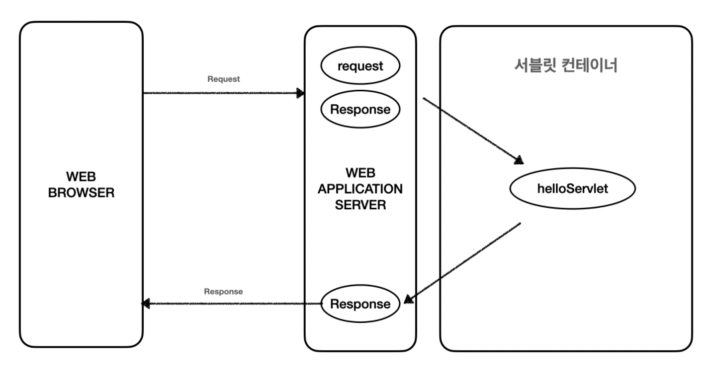
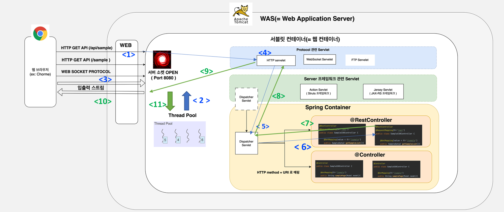
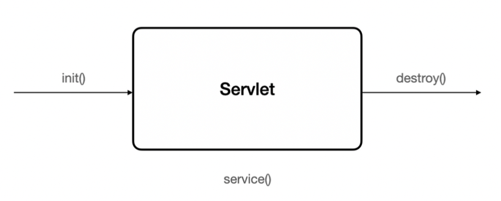

# 서블릿에 대해 설명해 주세요.

- 과거 웹이 발달하기 전에는 클라이언트 요청에 항상 정적인 웹 페이지를 넘겨주었다.(HTML이나 CSS 같은)
- 하지만 웹이 점점 발전해 가면서 클라이언트 요청에 동적으로 변하는 웹 페이지를 넘겨야만 하게 됐다.
- 그래서 동적인 페이지를 처리하는 **WAS** 앞에 **웹 서버**를 두고 웹 서버에서는 정적인 페이지만 처리하고, WAS에서는 동적인 페이지를 처리하도록 했다.
- 그리고 WAS에서 동적인 페이지를 처리하기 위해서 사용하는 것이 바로 **Servlet**이다.
- **Servlet이란?**
  - **동적 컨텐츠를 만드는 데에 사용되는 자바 기반의 웹 애플리케이션 프로그래밍 기술**

## 서블릿 동작 방식

- 사용자가 요청을 하면 `HTTP Request` 가 **WAS**로 전송이 된다.
- 요청을 전송받은 **서블릿 컨테이너**는  `HttpServletRequest`, `HttpServletResponse` 객체를 생성한다.
  - 이 Http 요청 정보가 담긴 객체들은 밑에 서블릿 객체를 찾을 때 전달된다.
- **WAS**에서 서블릿 컨테이너에 등록된 서블릿 객체 중 요청 URL에 맞는 서블릿 객체를 찾아서 호출한다.
  - 서블릿 객체를 서블릿 컨테이너에 등록하기 위해서는 `web.xml`이나 `@WebServlet` 애노테이션으로 등록할 수 있다.
- 서블릿의 `service()` 메서드를 호출한 후 클라이언트 HTTP 요청 메서드에 따라 `doGet()`, `doPost()` 등의 메서드를 호출한다.
- 개발자는 `HttpServletResponse` 객체에 응답 정보를 동적으로 입력한다.
- **WAS**는 `HttpServletResponse` 객체에 담겨 있는 내용으로 HTTP 응답 정보를 생성한 후 응답을 한다. 
- 응답 후 서블릿 컨테이너는 `HttpServletRequest`와 `HttpServletResponse` 객체를 소멸한다.

## 서블릿 컨테이너

- **서블릿 컨테이너**는 스프링에서 서블릿을 관리해주는 컨테이너이다.
- 서블릿 객체를 생성, 초기화, 호출, 종료하는 생명주기를 관리한다.
- **서블릿 객체는 싱글톤으로 관리되며, 동시 요청을 위한 멀티 쓰레드 처리를 지원한다.**

- 서블릿 컨테이너는 서블릿과 웹 서버를 통신할 수 있도록 해준다.
- 서블릿 컨테이너는 요청이 올 때마다 쓰레드를 생성하는데, 쓰레드 풀을 통해 쓰레드를 관리해 전체 쓰레드 수를 조절한다.

## 서블릿 생명주기

- 최초 로딩 시점(서버가 시작될 때)에 `init()`을 호출해 싱글톤으로 서블릿 인스턴스를 생성하고 관리를 시작한다. 
- 클라이언트 요청이 들어오면 `service()`를 호출해 실제 기능을 수행한다.
  - HTTP Method에 따라 `doGet()`, `doPost()` 등 메서드 호출
  - `doXxx()` 메서드는 개발자가 직접 구현한다.
- `destroy()`로 서블릿 인스턴스를 제거한다.
  - 보통 서블릿 컨테이너가 종료되는 시점에 호출된다.(서버가 종료될 때)

**각 메서드는 서블릿 컨테이너(톰캣)가 호출해준다.**

> **서블릿을 사용하여 동적 페이지를 처리할 수 있지만, HTML을 자바 코드로 작성해야 해 많은 불편함이 있었다.**  
> 그래서 JSP를 사용하여 HTML 작업을 분리하고, MVC 패턴을 도입해 역할을 더 세분화하여 하도록 했다. 
> 하지만 요청이 증가할수록 요청 URL마다 다른 서블릿 인스턴스를 생성하는 것도 부담이 되고, 컨트롤러에서 공통으로 처리해야 하는 부분이 증가했다.
> 
> **그래서 스프링은 디스패처 서블릿(DispatcherServlet)을 사용해 프론트 컨트롤러 패턴으로 이 문제를 해결했다.**
> 
> `DispatchServlet`은 스프링 MVC의 핵심 요소 중 하나로, 클라이언트의 모든 요청은 이 서블릿에게 전달되고, 이 서블릿은 적절한 핸들러(컨트롤러)를 찾아서 실행해준다.

 

### 참고
- [참고 동영상](https://www.youtube.com/watch?v=2pBsXI01J6M&t)
- [참고 동영상](https://www.youtube.com/watch?v=calGCwG_B4Y)
- [참고 동영상](https://www.youtube.com/watch?v=3gmOuUWPZV4)
- [참고 블로그](https://steady-coding.tistory.com/599)
- [참고 블로그](https://tecoble.techcourse.co.kr/post/2021-05-23-servlet-servletcontainer/)
